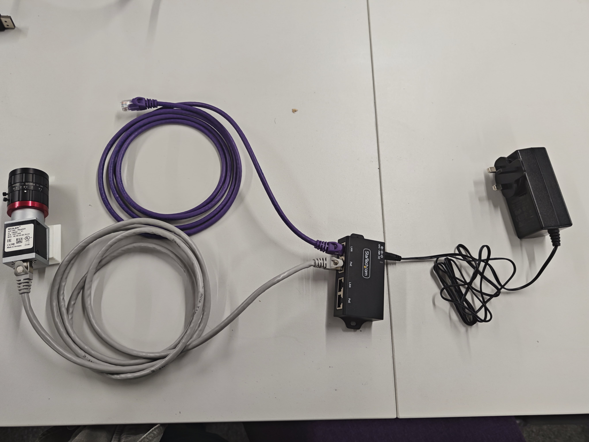
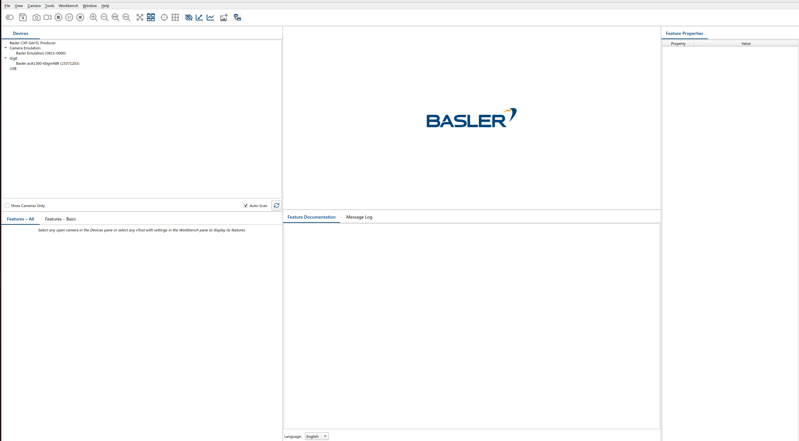
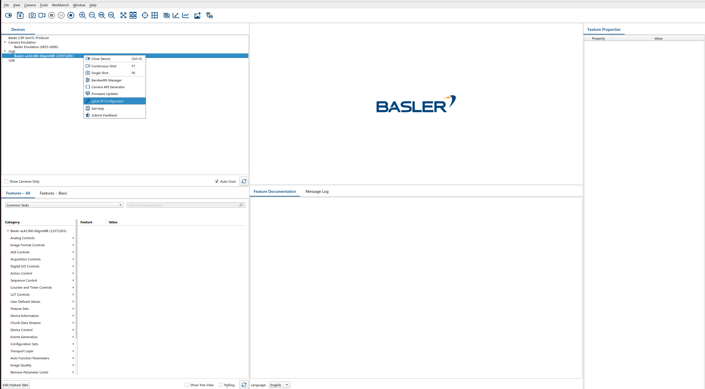
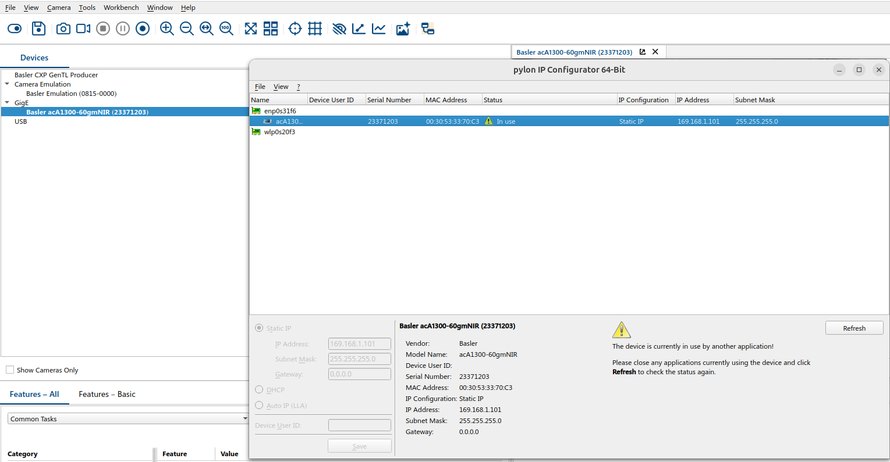
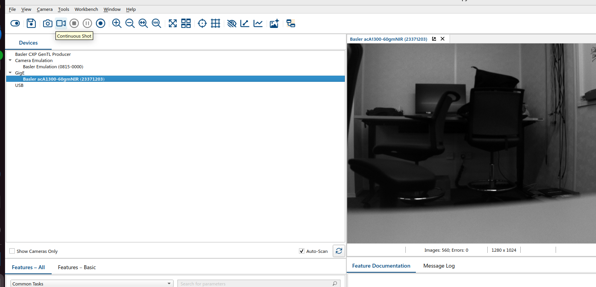
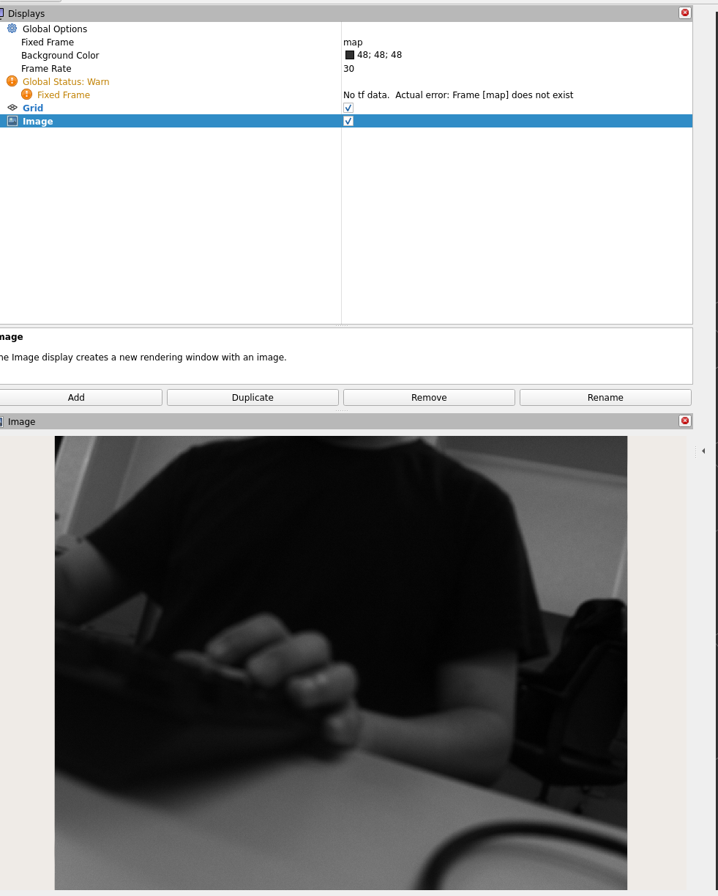

# Basler acA1300-60gmNIR
## 1 Kit components
Author: zhongmou.li@manchester.ac.uk

**Kit**
- Basler acA1300 60gmNIR
- Power module
- Ethernet cable 
- Injector
- API pylon 25.06

**Host machine**
- Ubuntu 22.04
- ROS2 Humble


## 2 acA1300 specifications
- Resolution (H x V Pixels): 1282 x 1026
More details can be found at [acA1300-60gmNIR](https://docs.baslerweb.com/aca1300-60gmnir).

- Power supply
    - **Power supply via Power over Ethernet (PoE)**: Power must comply with the **IEEE 802.3af** specification.
      - **IEEE 802.3af** for (POE) provides up to 12.95W power, while **IEEE 802.3at** for (POE+) provides up to 25.5W powe
    - **Power supply via I/O connector**: The operating voltage is 12–24 VDC. As a minium, 10.8 VDC must be supplied. To avoid damage to the cameras, a maximum of 30 VDC must not be exceeded.

More details about Power Over Ethernet (POE) can be found at [Power Over Ethernet (PoE and PoE+) - in 5 Minutes](https://youtu.be/dVq9jHwmCrY?si=7tDtoEvmzJGhH-XI).

Cudy New 30W Gigabit PoE Injector Adapter, 30W,10/100/1000Mbps RJ-45, IEEE 802.3af / 802.3at Compliant, up to 100 Meters (325 Feet), PoE200


## 3 Software Pylon for acA1300-60gmNIR
Software needed can be found at [Basler Software Downloads](https://www.baslerweb.com/en/downloads/software/#type=pylonsoftware;version=all;os=all).

Here two software are downloaded:
- pylon 25.06
- pylon Supplementary Package for blaze 1.7.3

In the folder of pylon 25.06, we can find three files 
- INSTALL (read this file)
- codemeter_8.20.6558.501_amd64.deb
- pylon_25.06.4-deb0_amd64.deb

and install by running 
```bash
  sudo apt-get install ./pylon_*.deb ./codemeter*.deb
```
then, unplug and reboot the computer.

## 4 acA1300-60gmNIR with PoE
### 4.1 Obtain images using official software Pylon 
The first step is to obtain images from the camera using the software Pylon.

We use a PoE injector to connect the camera and the host machine and the power is provided by AC.

  

The executables of pylon are located in `/opt/pylon/bin`. We can start by running 
```bash
    QT_QPA_PLATFORM=xcb /opt/pylon/bin/pylonviewer
```
to get the GUI work. It might crush without `QT_QPA_PLATFORM=xcb` and more details can be found at [BUG: Segfault in Pylon viewer issues 760](https://github.com/basler/pypylon/issues/760).

A GUI should appear as below and we can find the device in the left top corner.
  

Since the camera is connected through a Ethernet port, we need to set an IP address of the camera. Right click the device's name and choose the option `Pylon IP Configurator`.
  
Then, we should be able to set the IP address under the corresponding network interface. Note that the IP address of the camera must be within the same subnect of the host machine.
  

After setting the IP address, we click the icon of video which means continuse shots and we are supposed to see the images captured by the camera in real time.
    

### 4.2 Obtain images using ROS2 driver
A ROS2 driver is provided by Basler at github [basler/pylon-ros-camera ](https://github.com/basler/pylon-ros-camera/tree/humble).

In ROS2 humble, launch with 
```bash
  ros2 launch pylon_ros2_camera_wrapper pylon_ros2_camera.launch.py
```
then we should obtain a ROS2 topic list as
```bash
root@raico1:/@ ros2 topic list
/clicked_point
/diagnostics
/goal_pose
/initialpose
/my_camera/pylon_ros2_camera_node/blaze_camera_info
/my_camera/pylon_ros2_camera_node/blaze_cloud
/my_camera/pylon_ros2_camera_node/blaze_confidence
/my_camera/pylon_ros2_camera_node/blaze_depth_map
/my_camera/pylon_ros2_camera_node/blaze_depth_map_color
/my_camera/pylon_ros2_camera_node/blaze_intensity
/my_camera/pylon_ros2_camera_node/camera_info
/my_camera/pylon_ros2_camera_node/current_params
/my_camera/pylon_ros2_camera_node/image_raw
/my_camera/pylon_ros2_camera_node/status
/parameter_events
/rosout
/tf
/tf_static
```
The view of camera can be obtained through the topic `/my_camera/pylon_ros2_camera_node/image_raw` and it can be viwed in Rviz2



The message type of `/my_camera/pylon_ros2_camera_node/image_raw` is `sensor_msgs/msg/Image` and its frequency can be adjustied in the file `pylon_ros2_camera/pylon_ros2_camera_wrapper/config/default.yaml` where you can find 
```yaml
# Camera parameters

/**:
  ros__parameters:

    #  The tf frame under which the images were published
    camera_frame: pylon_camera

    #  The DeviceUserID of the camera. If empty, the first camera found in the
    #  device list will be used
    device_user_id: ""

    #  The CameraInfo URL (Uniform Resource Locator) where the optional intrinsic
    #  camera calibration parameters are stored. This URL string will be parsed
    #  from the ROS-CameraInfoManager:
    camera_info_url: ""

    #  The encoding of the pixels -- channel meaning, ordering, size
    #  taken from the list of strings in include/sensor_msgs/image_encodings.h
    #  The supported encodings are 'mono8', 'bgr8', 'rgb8', 'bayer_bggr8',
    #  'bayer_gbrg8' and 'bayer_rggb8'
    # image_encoding: 'mono8'

    #  Binning factor to get downsampled images. It refers here to any camera
    #  setting which combines rectangular neighborhoods of pixels into larger
    #  "super-pixels." It reduces the resolution of the output image to
    #  (width / binning_x) x (height / binning_y).
    #  The default values binning_x = binning_y = 0 are considered the same
    #  as binning_x = binning_y = 1 (no subsampling).
    # binning_x: 1
    # binning_y: 1

    #  The desired publisher frame rate if listening to the topics.
    #  This parameter can only be set once at startup
    #  Calling the GrabImages-Action can result in a higher framerate
    frame_rate: 100.0

    #  Mode of camera's shutter.
    #  The supported modes are "rolling", "global" and "global_reset"
    #  Default value is "" (empty) means default_shutter_mode
    # shutter_mode: ""

    ##########################################################################
    ######################## Image Intensity Settings ########################
    ##########################################################################
    # The following settings do *NOT* have to be set. Each camera has default
    # values which provide an automatic image adjustment resulting in valid
    # images
    ##########################################################################

    #  The exposure time in microseconds to be set after opening the camera.
    # exposure: 1000.0

    #  The target gain in percent of the maximal value the camera supports
    #  For USB cameras, the gain is in dB, for GigE cameras it is given in so
    #  called 'device specific units'.
    # gain: 0.5

    #  Gamma correction of pixel intensity.
    #  Adjusts the brightness of the pixel values output by the camera's sensor
    #  to account for a non-linearity in the human perception of brightness or
    #  of the display system (such as CRT).
    # gamma: 1.0

    #  The average intensity value of the images. It depends the exposure time
    #  as well as the gain setting. If 'exposure' is provided, the interface will
    #  try to reach the desired brightness by only varying the gain. (What may
    #  often fail, because the range of possible exposure vaules is many
    #  times higher than the gain range). If 'gain' is provided, the interface will
    #  try to reach the desired brightness by only varying the exposure time. If
    #  gain AND exposure are given, it is not possible to reach the brightness,
    #  because both are assumed to be fix.
    # brightness: 100

    #  Only relevant, if 'brightness' is set:
    #  The brightness_continuous flag controls the auto brightness function.
    #  If it is set to false, the brightness will only be reached once.
    #  Hence changing light conditions lead to changing brightness values.
    #  If it is set to true, the given brightness will be reached continuously,
    #  trying to adapt to changing light conditions. This is only possible for
    #  values in the possible auto range of the pylon API which is e.g., [50 - 205]
    #  for acA2500-14um and acA1920-40gm
    # brightness_continuous: true

    #  Only relevant, if 'brightness' is set:
    #  If the camera should try to reach and / or keep the brightness, hence
    #  adapting to changing light conditions, at least one of the following flags
    #  must be set.
    #  If both are set, the interface will use the profile that tries to keep the
    #  gain at minimum to reduce white noise.
    #  The exposure_auto flag indicates, that the desired brightness will be
    #  reached by adapting the exposure time.
    #  The gain_auto flag indicates, that the desired brightness will be
    #  reached by adapting the gain.
    # exposure_auto: true
    # gain_auto: true

    ##########################################################################

    #  The timeout while searching the exposure which is connected to the
    #  desired brightness. For slow system this has to be increased.
    # exposure_search_timeout: 5.0

    #  The exposure search can be limited with an upper bound. This is to prevent
    #  very high exposure times and resulting timeouts.
    #  A typical value for this upper bound is ~2000000us.
    #  Beware that this upper limit is only set if `startup_user_set` is set to `Default`.
    # auto_exposure_upper_limit: 2000000.0

    #  The MTU size. Only used for GigE cameras.
    #  To prevent lost frames configure the camera has to be configured
    #  with the MTU size the network card supports. A value greater 3000
    #  should be good (1500 for single-board computer)
    # gige:
    #  mtu_size: 3000

    #  Only used for GigE cameras.
    #  The inter-package delay in ticks to prevent lost frames.
    #  For most of GigE cameras, a value of 1000 is reasonable.
    #  For cameras used on a single-board computer this value should be set to 11772.
    # gige:
    #  inter_pkg_delay: 1000

    #  Only used for GigE cameras.
    #  The frame transmission delay in ticks.
    #  In most cases, this parameter should be set to 0.
    #  However, if your network hardware can't handle spikes in network traffic
    #  (e.g., if you are triggering multiple camera simultaneously),
    #  you can use the frame transmission delay parameter to stagger the
    #  start of image data transmissions from each camera.
    # gige:
    #  frame_transmission_delay: 0
```


