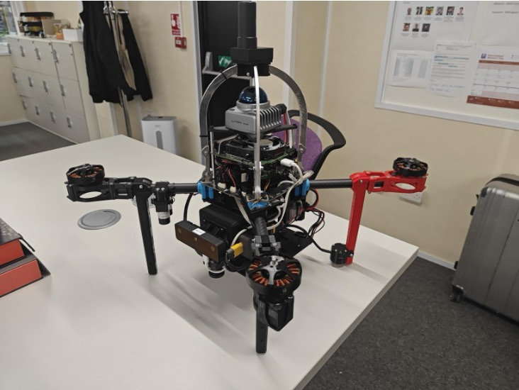
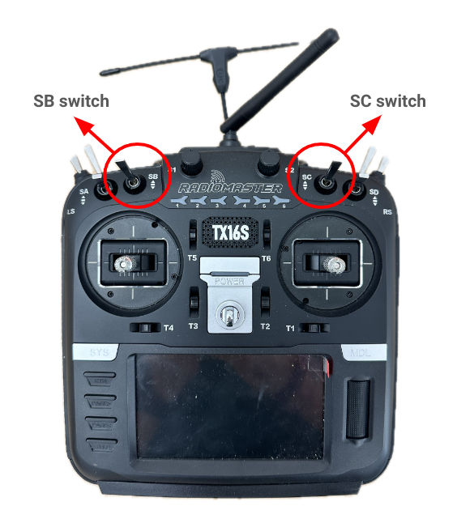
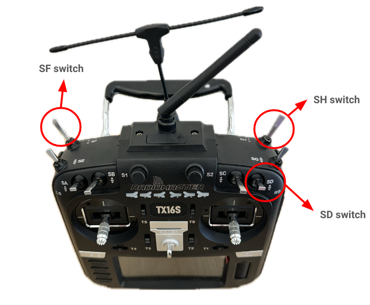
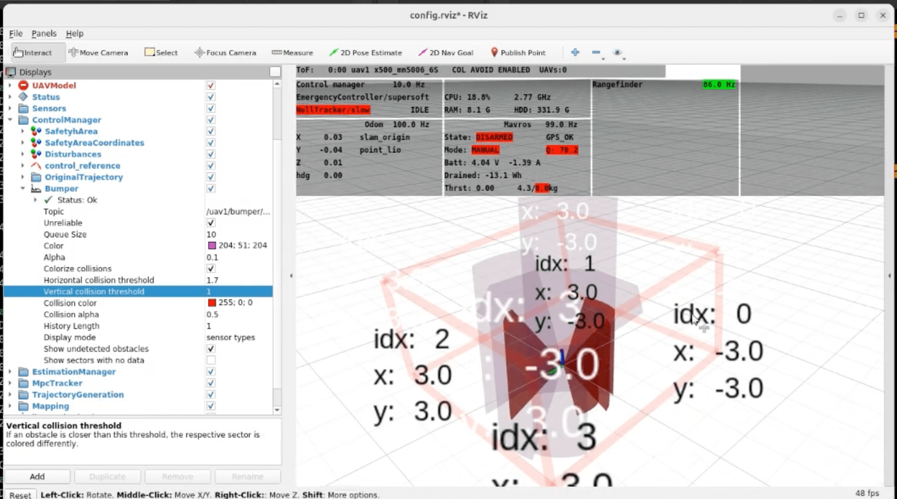
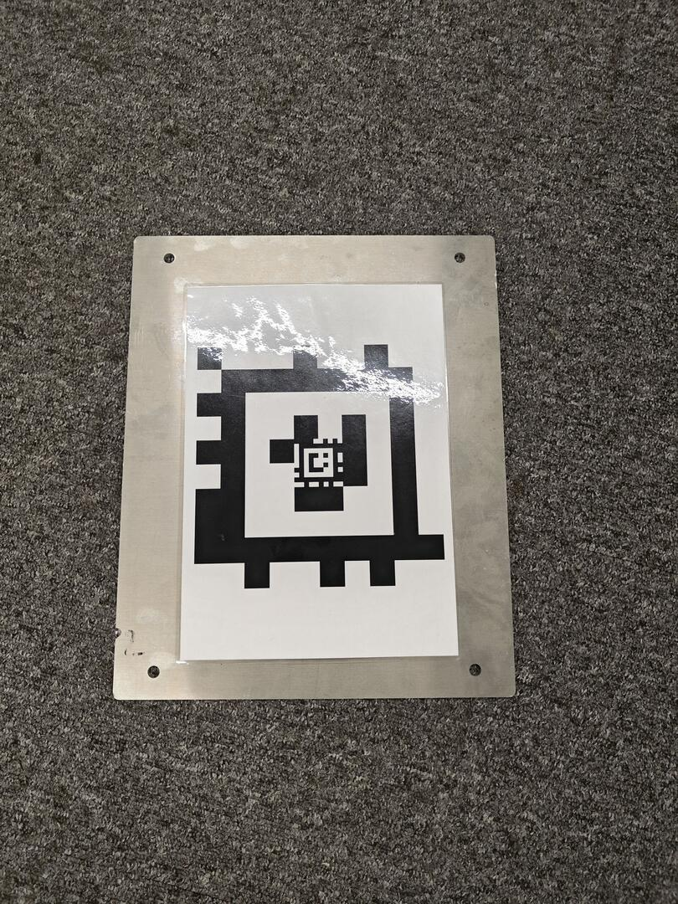
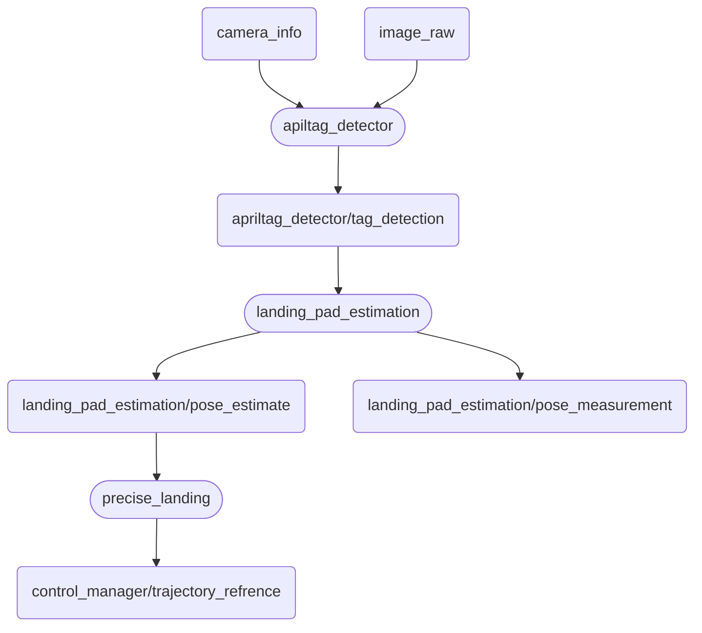

# Fly4Future Quadrotor (designed for CORAL)
## 1 Kit component
Author: zhongmou.li@manchester.ac.uk

**Kit**
- Fly4Future quadrotor
- Onboard computer


**Onboard machine**
- Ubuntu 20.04
- ROS1 noetic

## 2 Specification
This drone developed by F4F based on our needs that can perform
- autonomous takeoff 
- localisation with Point-LIO
- precise landing with AprilTag

## 3 Login and Internet
### 3.1 First connect
The username is 'uav' and the password is `f4f`.
### 3.2 Wifi configuration with Netplan
The configuration file is defined at `/etc/netplan/01-netcfg.yam`

The yaml file defines Internet connections for both Ethernets and Wifi. For instance
```yaml
network:
  version: 2
  renderer: networkd  # or NetworkManager
  ethernets:
    # Ethernet interfaces
  wifis:
    # WiFi interfaces
```
Note: there are 2 Ethernet connections already: `eth0` is for Rajant nodes, while `etho1` is the for 3D LIDAR. Tools like `iftop` and `waveshark` are used to figure out which Ethernect connection is for LIDAR and which is for Rajant node.

Therefore, we need to configure a netplan file to set `etho0` to use Rajent nodes for communication.

Apply the changes running
```bash
    sudo netplan apply
```
We are also encouraged to edit host names to be free of typing IP addresses every time.
```bash
    vim /etc/hosts
```
and then add `192.168.131.11 raico` there. This IP belongs to base station in the CORAL project.

## 4 Launch Fly4Future
### 4.1 On the drone
The program located at `home/indoor_session/` that includes features like precise landing. Note that the `roscore` is running on the onboard computer and the `ROS_MASTER_URI` is decided by the onboard computer as well.

To start the program, we need to run 
```bash
    ./tmux.sh
```
which launches the program developed by F4F. The way to kill the process is `ctrl a` then press `k`.

### 4.2 on the base station
Modify `/ect/hosts` by adding `192.168.131.101 uav1`, then adding `export ROS_MASTER_URI=http://uav1:11311` and `export ROS_IP=192.168.131.:11`  to the `.bashrc`.

Then, start the container provided by F4F as well.

```bash
    cd mrs_apptainer
    ./wraper
```
We need to modify `.bashrc` in the container as well by adding 
 `export ROS_MASTER_URI=http://uav1:11311` and `export ROS_IP=192.168.131.:11`.

Now, we able to start the interface on the base station to control and monitor the drone using Rviz.

```bash
    rosrun mrs_uav_deployment rviz.sh uav1
```
A config file tested is located at `home/raico/user_ros_workspace/config.rviz` which can be imported. Or a bash script has also been provided at `home/raico/user_ros_workspace/rviz.sh`


## 5 rosnodes in CORAL drone
There are some basic pkgs as elements of MRS system and some additional pkgs developed for CORAL needs.
### 5.1 AutoStart Node
One pkg, or node, is called 'AutoStart' that is responsible for mode switch and auto takeoff. Therefore, the output of this node must be checked before takeoff: if the output is `current position is valid`, then it suggests OK to takeoff. 

#### Auto takeoff and offboard
It is the transmitter to control the drone to arm and switch to offboard. [Transmitter](https://documentation.fly4future.com/docs/deployment/06-remote-controller?product=default) includes more details.

Offboard mode switch is controlled by SB (closes to you position activates). But, it is essential to prepare to save drone by switching to manual mode (thrust + attitude as input), which is the up position of SC. 


Switching SB down close to you allows the manual control to take over the offboard mode. Therefore, keeping SC up (far from you) means the manual mode is activated when auto missions are operating, while in case of an emergency that we need to control the drone ourselves, we need to switching SB down while SC is Up. 



Arming the drone requires to pull the left stick to left-down position like PX4 and Ardupilot. However, Fly4Future says
>Whenever you will arm the drone, you will have a few seconds to switch to Offboard mode so that the drone will autonomously take off. If you don't do it in time, the drone will by our default settings disarm itself. 

#### Safety area 
Safety area is usually used for GNS flight. It is a rectangle.

It is defined in `indoor/session/config/world_local.yaml`i

#### Obstacle avoidance

The distance or threshold is defined in `indoor_session/config/custom_config.yaml`, i.e. the section `control manager/Obstacle bumper` with the parameters `horizontal/min_distance_to_obstacle` and  `veritcal/min_distance_to_obstacle`.

In terms of visualisation, we can tune Bumper in Rviz to visualise the obstacle detected. 



### 5.2 PointLIO for Localisation 
It subscribes to the topics `/uav1/livox/imu` and `/uav1/livox/lidar` to compute the pose of the drone publishing to the topic `/uav1/point_lio/odom`


### 5.3 Precise landing 
One pkg called [Precise Landing](https://ctu-mrs.github.io/docs/features/precise-landing/) is developed by Fly4Future. 

The precise landing is achieved with AprilTag and a Bazsler camera. The action of `precise landing` is activated by two services in ROS

The AprilTag definition is located at `~/indoor_session/config/precise_landing/apriltag.yaml`. It shows:
```yaml
    tag_family: `tagCustom48h12`
    standalone_tags:
    [
        {id:0, size: 0.116, name: recursive_tag_1_big},
        {id:10, size: 0.025, name: recursive_tag_1_small},
    ]
```
Based on this, one landing pas has been made in RAIco and it can be found in the mobile arena.  


Then, we can start the precise landing with two ways. The first is to use the Tmux section Land, and run the bash script `land.sh` that is provided by F4F. The other way is to call two services  
```bash
    rosservice call /uav1/precise_landing
    rosservice call /uav1/control_manager/bumber false
```
It will detect the AprilTag in the view of the camera and try to land. However, it may fail to land and go back to hovering status. If it does not land for 10-20 seconds, we can rerun the bash script.

This feature depends on two nodes `landing_pad_estimation` and `precise_landing`.




