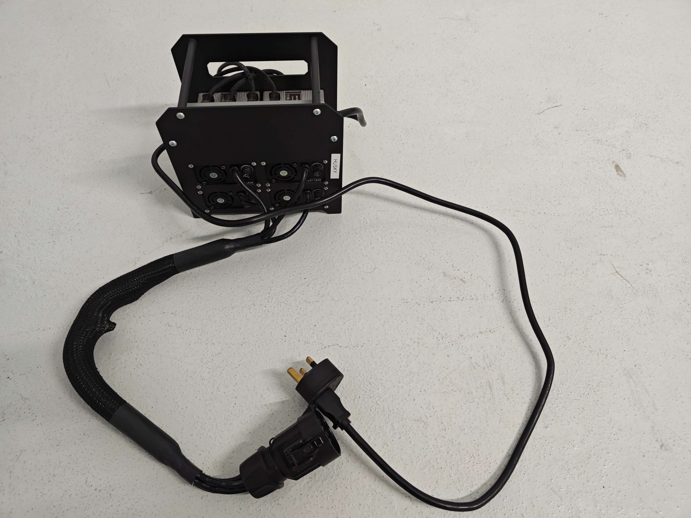
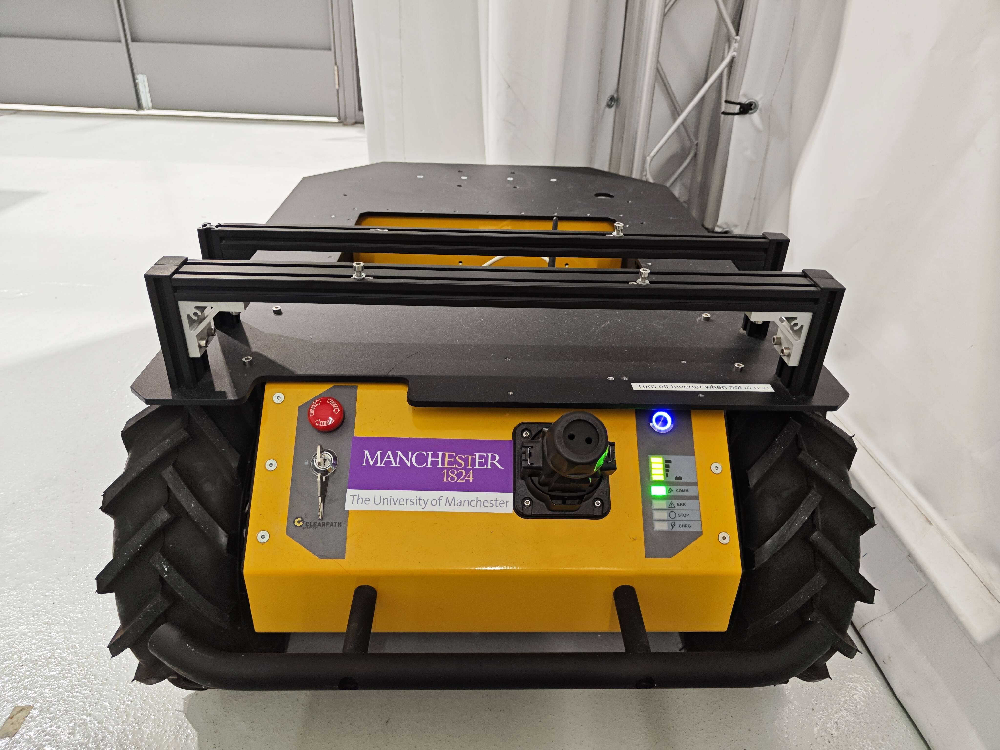

# Husky of clearpath
## 1 Kit components
Robot Husky kit include
- charger
- connector
- husky with onboard computer's OS being Ubuntu 20 
- joystick (you can uses your own, but have to configure)

Especially, the charger needs an adapter

## 2 Charge and operate Husky
### 2.1 Charge Husky

### 2.2 Operate Husky
It is obligatory to use the connector like this:

Then, we can press the button that is in blue shown in the image to turn on the robot.

A video guide is provided by Clearpath on Youtube, and you can find it here [Husky UGV | Unboxing and Getting Started](https://www.youtube.com/watch?v=H6lcvtpEYzs). It explains the emergency stop, connection light etc.

Then, we can use our joystick to operate it.

## 3 Communicate with Husky
The IP address 
### 3.1 log-in with a monitor

### 3.2  log-in wirelessly

## 3 ROS2-Docker for LIO-SAM application
### 3.1 Velodyne 3D LIDAR
