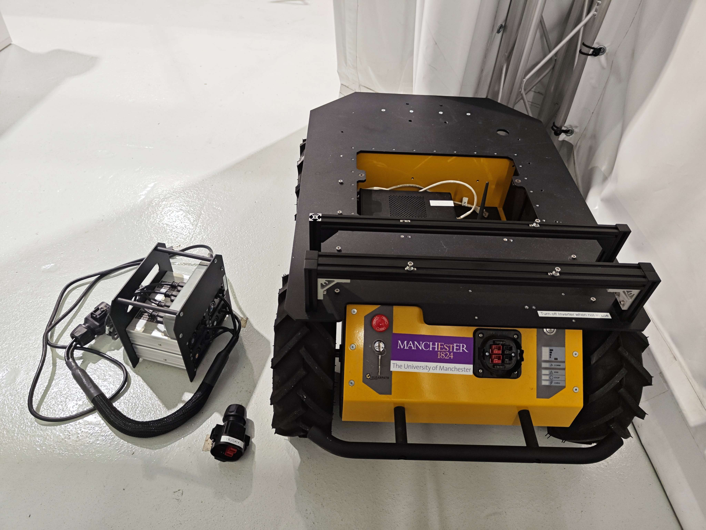
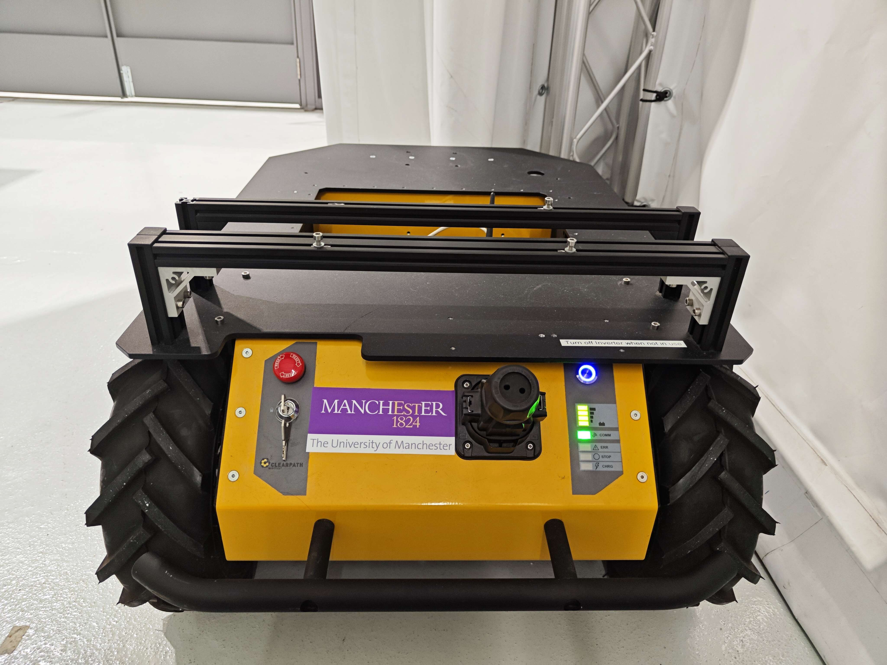

# Husky of clearpath
## 1 Kit components
Robot Husky kit include
- charger
- connector
- husky with onboard computer's OS being Ubuntu 20 
- joystick (you can uses your own, but have to configure)




Especially, the charger needs an adapter


Then, we can press the button that is in blue shown in the image to turn on the robot.

A video guide is provided by Clearpath on Youtube, and you can find it here [Husky UGV | Unboxing and Getting Started](https://www.youtube.com/watch?v=H6lcvtpEYzs). It explains the emergency stop, connection light etc.

Then, we can use our joystick to operate it.

In RAICo, a ps4 controller with a lable ``HUSKY```` is used to control the robot.

To use your ps4 controller, you need to repaire it following the steps [Joystick Controller Pairing](https://docs.clearpathrobotics.com/docs/ros/installation/controller/). 

To do that, we need to do the following steps:
1. make the ps4 controller in the ```pairing mode``` by pressing ```SHARE``` and ps4 logo buttions until it flashes quickly,
2. 

## 3 Communicate with Husky
Username: administrator
Pwd: clearpath
### 3.1 log-in with a monitor

### 3.2  log-in wirelessly
It is configured to connect to WIFI CORAL_5G with an IP address ```192.168.100.226```

Then on the host machine, we can login with
```bash
    ssh administrator@192.168.100.226
```
## 3 ROS2-Docker for LIO-SAM application
### 3.1 Velodyne 3D LIDAR
