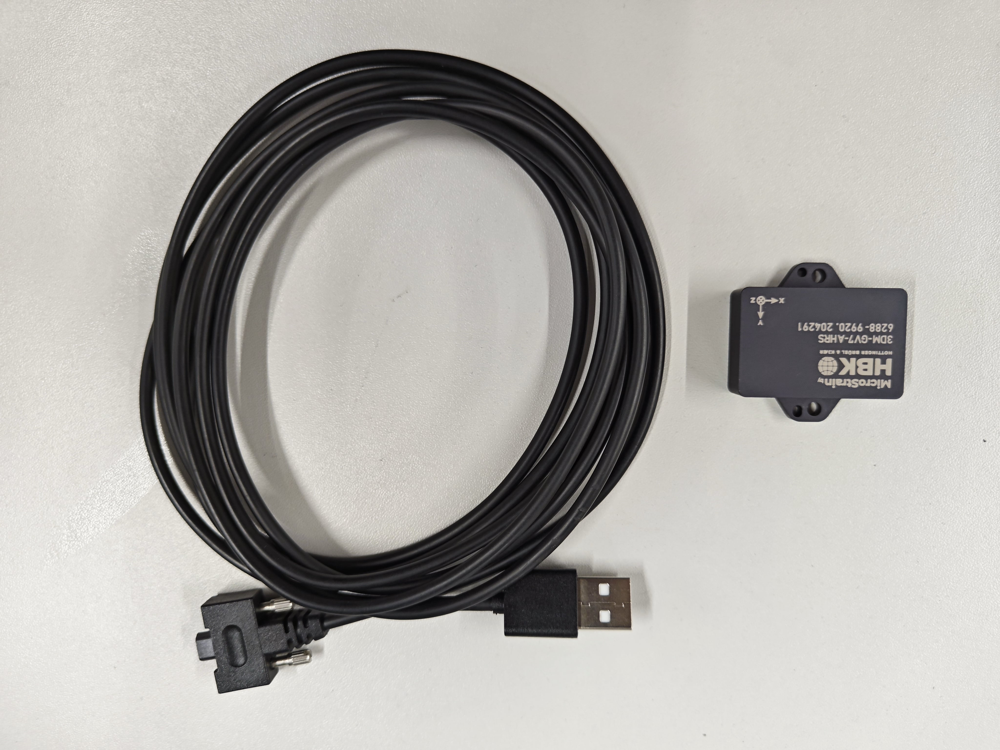

# MicroStrain IMU (3DM-GV7-AHRS)
## 1 Kit component
Author: zhongmou.li@manchester.ac.uk

**Kit**
- MicroStrain 3DM-GV7-AHRS  
- Wire with a USB port provided by MicroStrain


**Host machine**
- Ubuntu 22.04
- ROS2 Humble

## 2 Specification
A 9-axis IMU module that provides measurements of linear acceleration, angular rate and attitude. 

Datasheet can be found at [MicroStrain 3DM-GX5-AHRS](https://www.microstrain.com/inertial-sensors/3dm-gx5-25).

Some important information is listed here:
- Attitude
    - Attitude Frequency: 1 - 1000 Hz
    - Static Roll/Pitch Accuracy: 0.25°
	- Dynamic Roll/Pitch Accuracy: 0.5°
	- Static Heading (AHRS only): 0.5°
	- Dynamic Heading (AHRS only): 2°

- Accelerometer 
    - Resolution: not given clearly
    - Sampling rate: 1 kHz  
- Gyroscope 
    - Resolution: not given clearly
    - Sampling rate: 1000 Hz 

## 3 Install and run ROS2 driver
The ROS2 driver on githuub is [microstrain_inertial](https://github.com/LORD-MicroStrain/microstrain_inertial/tree/ros2).


1. To enable the device to be found, we modify ```microstrain_inertial_examples/config/cv7/cv7.yml```.
   We set the port to be where the device is mounted in the system
      ```yml
      port : '/dev/ttyACM0'
      ```
   or, we can simply use
      ```yml
      port : '/dev/microstrain_main'
      ```  
which requires to copy ```100-microstrain.rules``` in this folder to the folder ```/etc/udev/rules.d/100-microstrain.rules```robot/host machine that the device is connected to.

Then, the device will be detected as ```/dev/microstrain_main``` automatically. In using Docker, remember to ```-v /dev/microstrain_main:/dev/microstrain_main```.

3. We also need to set the tf parameters for GV7 to define the localisation of GV7 in the tf tree of the robot. In ```microstrain_inertial_examples/launchcv7_launch.py```
   - for 
  ```python
       Node(
      package='tf2_ros',
      executable='static_transform_publisher',
      output='screen',
      arguments=[
            "--x", "0",
            "--y", "0",
            "--z", "0",
            "--roll", "0",
            "--pitch", "0",
            "--yaw", "0",
            "--frame-id", "map",
            "--child-frame-id", "base_link"
         ]
      ),
  ```
   
4. launch the driver by running      

   ```bash
      ros2 launch microstrain_inertial_examples cv7_launch.py
   ```
