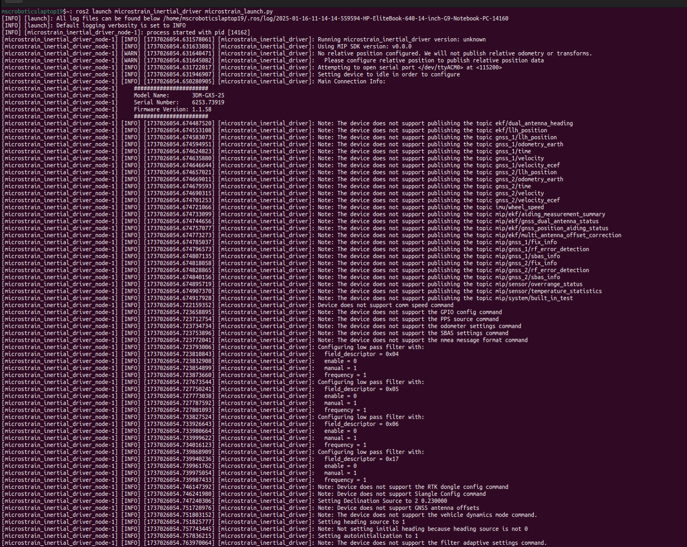

# MicroStrain IMU (3DM-GX5-25)
## 1 Kit component
Author: zhongmou.li@manchester.ac.uk

**Kit**
- MicroStrain 3DM-GX5-AHRS  
- Wire with a USB port provided by MicroStrain


**Host machine**
- Ubuntu 22.04
- ROS2 Humble

## 2 Specification
A 9-axis IMU module that provides measurements of linear acceleration, angular rate and attitude. 

Datasheet can be found at [MicroStrain 3DM-GX5-AHRS](https://www.microstrain.com/inertial-sensors/3dm-gx5-25).

Some important information is listed here:
- Attitude
    - Attitude Frequency: 1-500HZ
    - Attitude resolution: < 0.01°
- Accelerometer 
    - Resolution: 0.02 mg
    - Sampling rate: 1 kHz  
- Gyroscope 
    - Resolution: <0.003°/sec
    - Sampling rate: 4 kHz  

## 3 Install and run ROS2 driver
The ROS2 driver on githuub is [microstrain_inertial](https://github.com/LORD-MicroStrain/microstrain_inertial/tree/ros2).

### 3.1 Install driver
1. ```apt``` for humble
```shell
    # install using apt
    sudo apt update
    # install driver
    sudo apt install ros-humble-microstrain-inertial-driver
    # install rqt
    sudo apt install ros-humble-microstrain-inertial-rqt
```


### 3.2 Run driver to obtain ROS2 topics
1. ros2 launch node
```shell
    ros2 launch microstrain_inertial_driver microstrain_launch.py
```
which leads to


2. we should be able to see ros2 topics and echo them 


### 3.3 Tune frequency of ROS2 topics
The default frequency of ``/imu/data```` is 1Hz. We can modify the topic frequency following the steps below:
- go to the folder ```/opt/ros/humble/share/microstrain_inertial_driver/microstrain_inertial_driver_common```
- modify the ```params.yml``` changing the values of ```imu_data_rate``` and ```imu_data_raw_rate``` 500 for example 
.
- source ros2 
```shell
    source /opt/ros/humble/setup.bash
```
