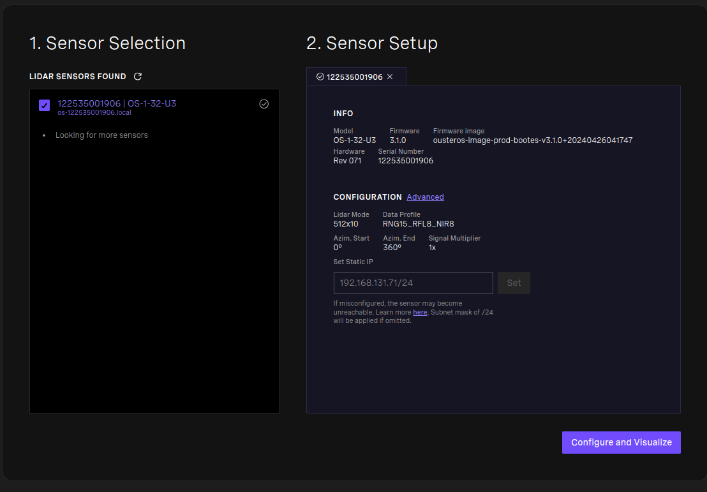
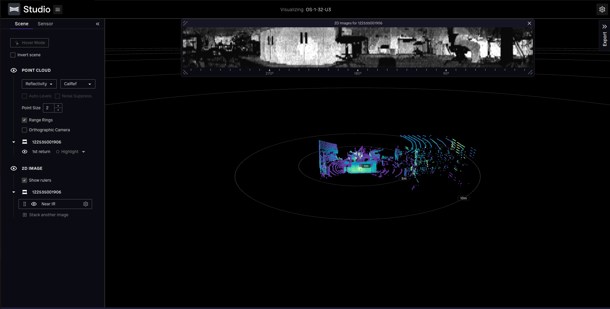
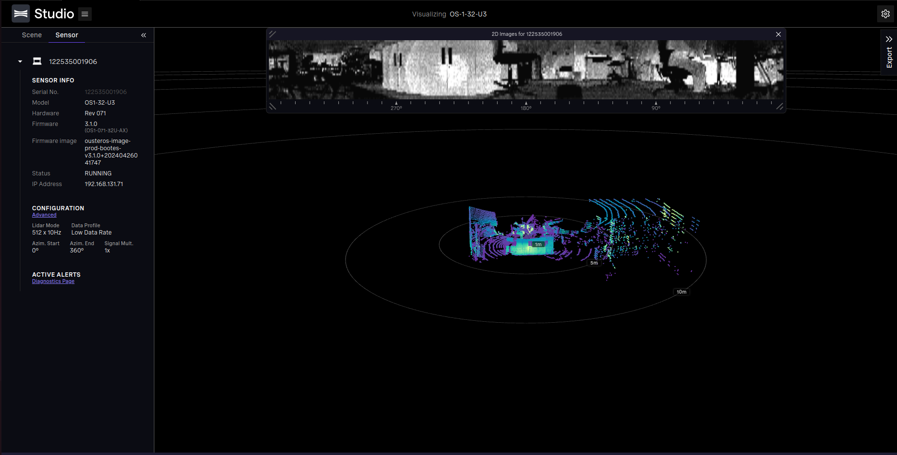
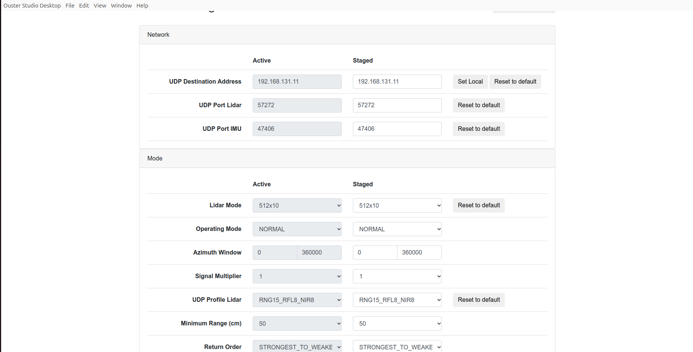

# Ouster 3D Lidar (OS1-32-U)
## 1 Kit components
Author: zhongmou.li@manchester.ac.uk

**Kit**
- OS1-32-U
- Power module
- Ethernet cable 


**Host machine**
- Ubuntu 22.04
- ROS2 Humble

## 2 Ouster specifications
- Model : OS1-32-U
- Serial number: 122535001906
- Number of channels: 32
- Horizontal field of view: 360d
- Horizontal resolution: 0.1d - 0.4d depending on LIDAR's RPM
    - 300RPM - 0.1d
    - 600RPM - 0.2d (**chosen**)
    - 900RPM - 0.3d
    - 1200RPM - 0.4d
    - source: Table 8-1 Rotation Speed vs Resolution in VLP-16 User Manual
- Minimal LIDAR range
- Maximal LIDAR range: 100m
- Range accuracy: <±3 cm 
- *Horizon_SCAN = 360/0.2=1800*


## 3 Setup OS1-32-U
The official guid is given at [Ouster: Quick Start Guide](https://static.ouster.dev/sensor-docs/image_route1/image_route2/connecting/connecting-to-sensors.html#connecting-to-sensor).

### 3.1 Set IP address 
After connectiong the LIDAR to the host machine through an Ethernet cable, we can use the sensor web interface to configure the LIDAR's IP address, working mode.

There are two ways to do that: the one is using the web brower, and the other is through the Ouster Studio.

The Ouster Studio can be very helpful and recommended, which can be downloaded for Linux, Windows and MacOS from https://ouster.com/products/software/ouster-studio.

Once we run the Ouster Studio, we will see the welcome page showing the serial number, the wokring mode. 



At this page, we are able to set the IP address of the LIDAR under the section `Set Static IP`.

It is also encouraged to check if the connection works by visulising the data. To do this, click `Configure and Visulize`. We should see the 3D scan and an image like below.



The Ouster Studio also allows us to configure the working mode, the where to send the LIDAR data. In the panel Sennsor on the left, we can see configuration information of the current settings.


Click `Advanced` under the Section `Configuration`, then we will see a configuration interface shown at [https://static.ouster.dev/sensor-docs/image_route1/image_route2/connecting/connecting-to-sensors.html](https://static.ouster.dev/sensor-docs/image_route1/image_route2/connecting/connecting-to-sensors.html). 

One thing to notice is that the LIDAR is sending its data to a `destination`, which should be the computer which accesses the data. For instance, our computer's IP address is `193.168.131.11`, then we put this IP address as `UDP Destination Address`.



### 3.2 Install ROiS2 drvers
The dependencies include
- `ros-humble-pcl-ros` 
- `ros-humble-tf2-eigen` 
- `ros-humble-rviz2` 
- `libjsoncpp-dev` 
- `libspdlog-dev` 
- `libcurl4-openssl-dev` 
which can be installed with the following command
```bash
# dependencies
sudo apt update && sudo apt install -y ros-humble-pcl-ros ros-humble-tf2-eigen ros-humble-rviz2 libjsoncpp-dev libspdlog-dev libcurl4-openssl-dev 
```
Then we can download the driver source code from Github and build it inside our ROS2 workspace.

```bash
cd ~/ros2_ws
git clone -b ros2 --recurse-submodules https://github.com/ouster-lidar/ouster-ros.git ./src/ouster-ros
colcon build #buid the pkgs including ouster_ros
```
## 4 Configure and Run drivers
### 4.1 ROS2 commands to launch the driver 
```bash
    ros2 launch ouster_ros sensor.launch.xml sensor_hostname:=192.168.131.71 viz:=false timestamp_mode:=TIME_FROM_ROS_TIME
```
where `sensor_hostname` is followed by the ip address of the LIDAR 


Then, we should obtain these topics 

```
/clicked_point
/goal_pose
/initialpose
/ouster/imu
/ouster/metadata
/ouster/nearir_image
/ouster/os_driver/transition_event
/ouster/points
/ouster/range_image
/ouster/reflec_image
/ouster/scan
/ouster/signal_image
/ouster/telemetry
/parameter_events
/rosout
/tf
/tf_static
```

### 3.2 Frame and direction
The frame of LIDAR data, i.e. `/ouster/points` is defined as bellow


where x from the sensor to the power, z up.