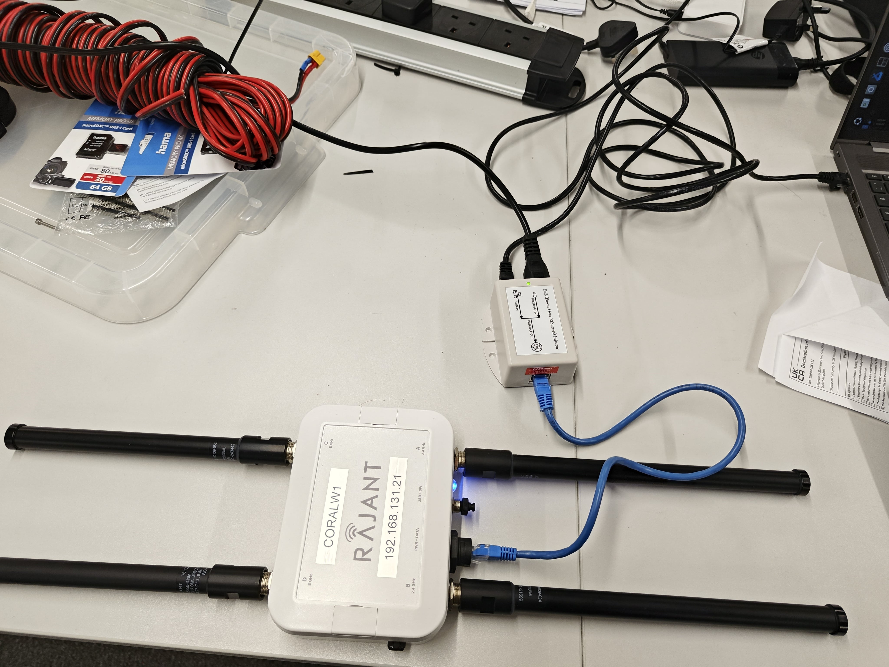
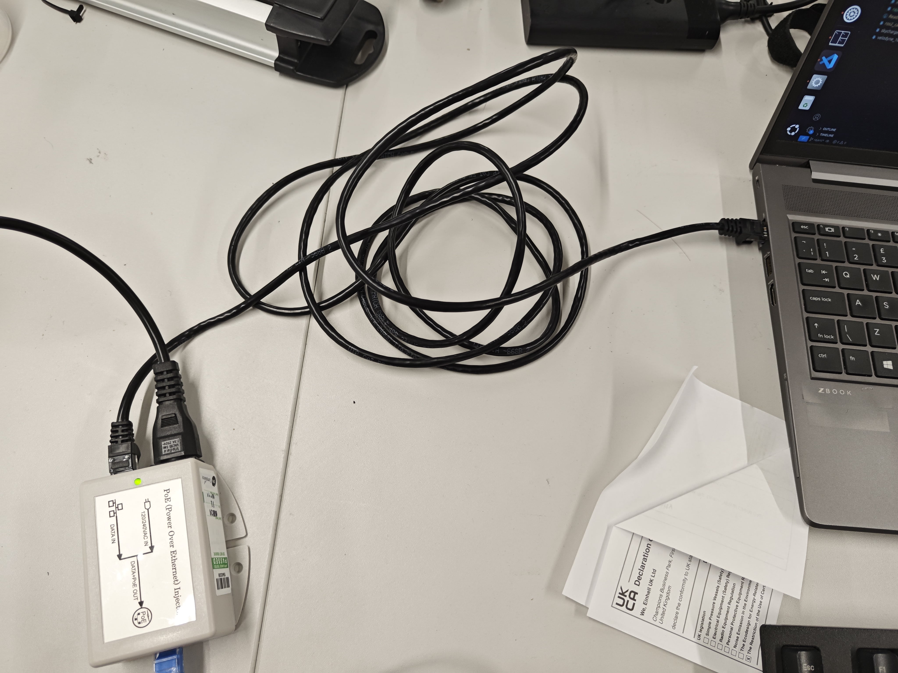
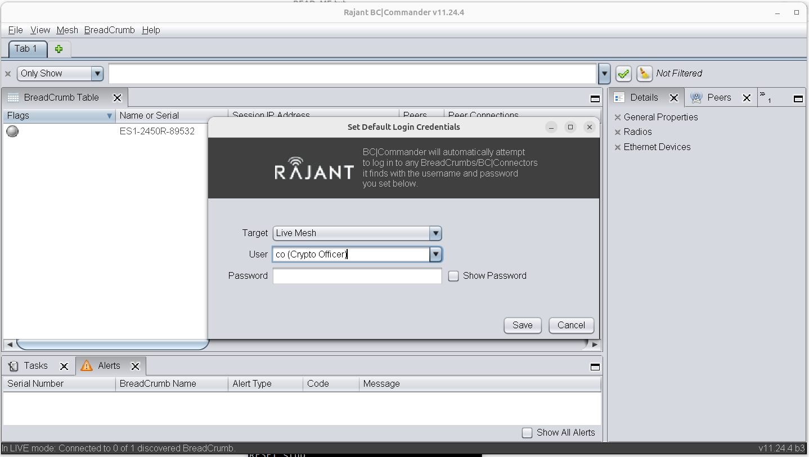
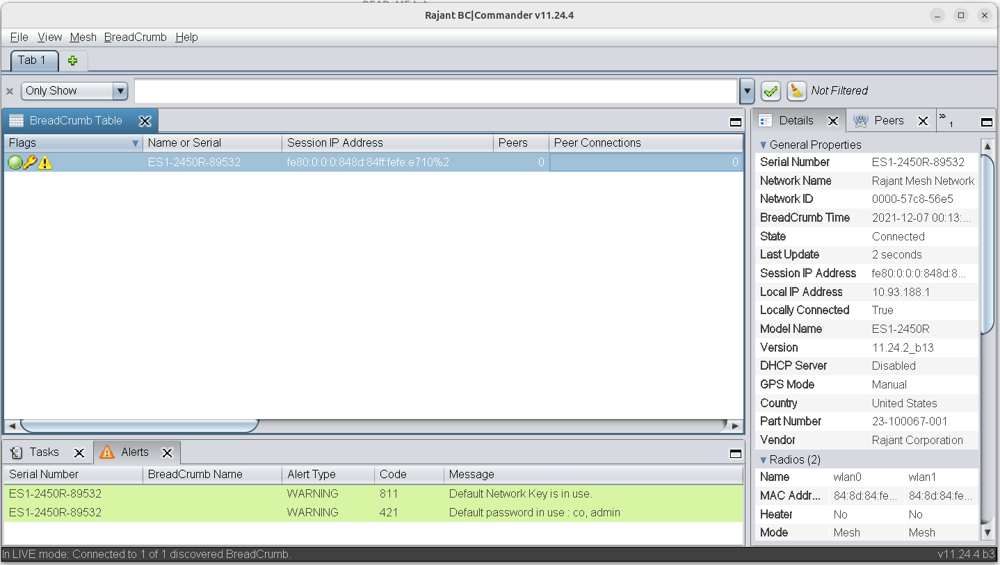
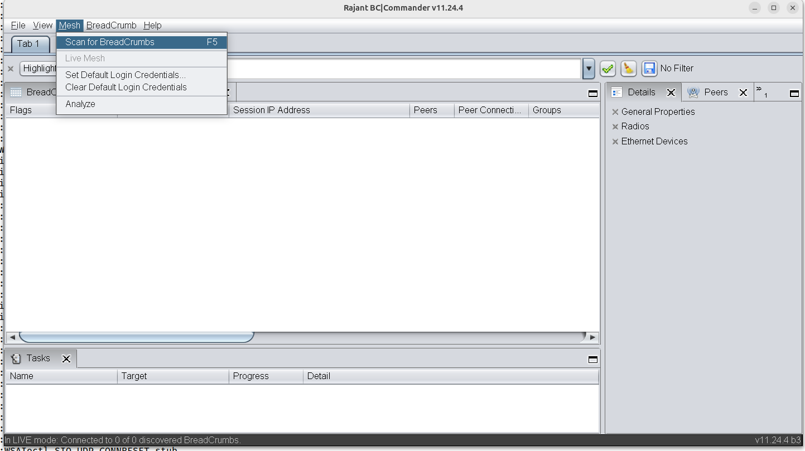
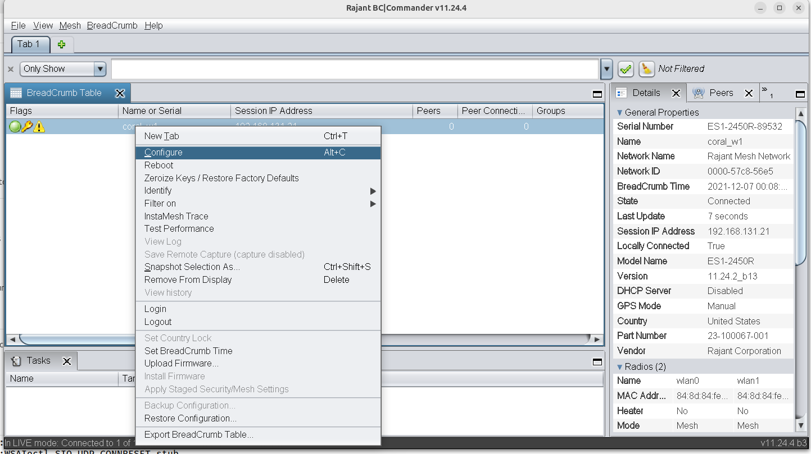
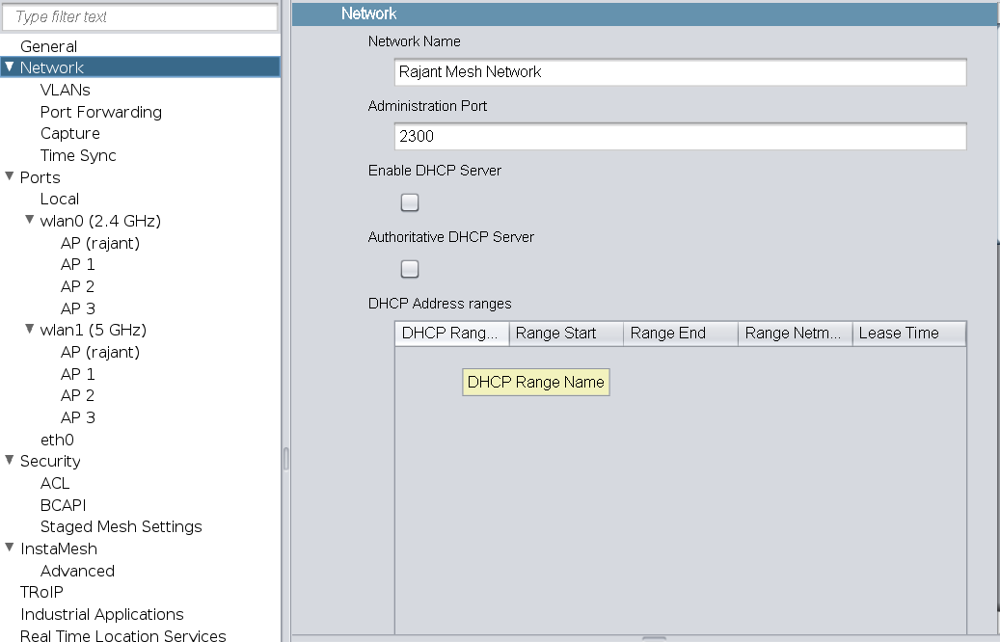
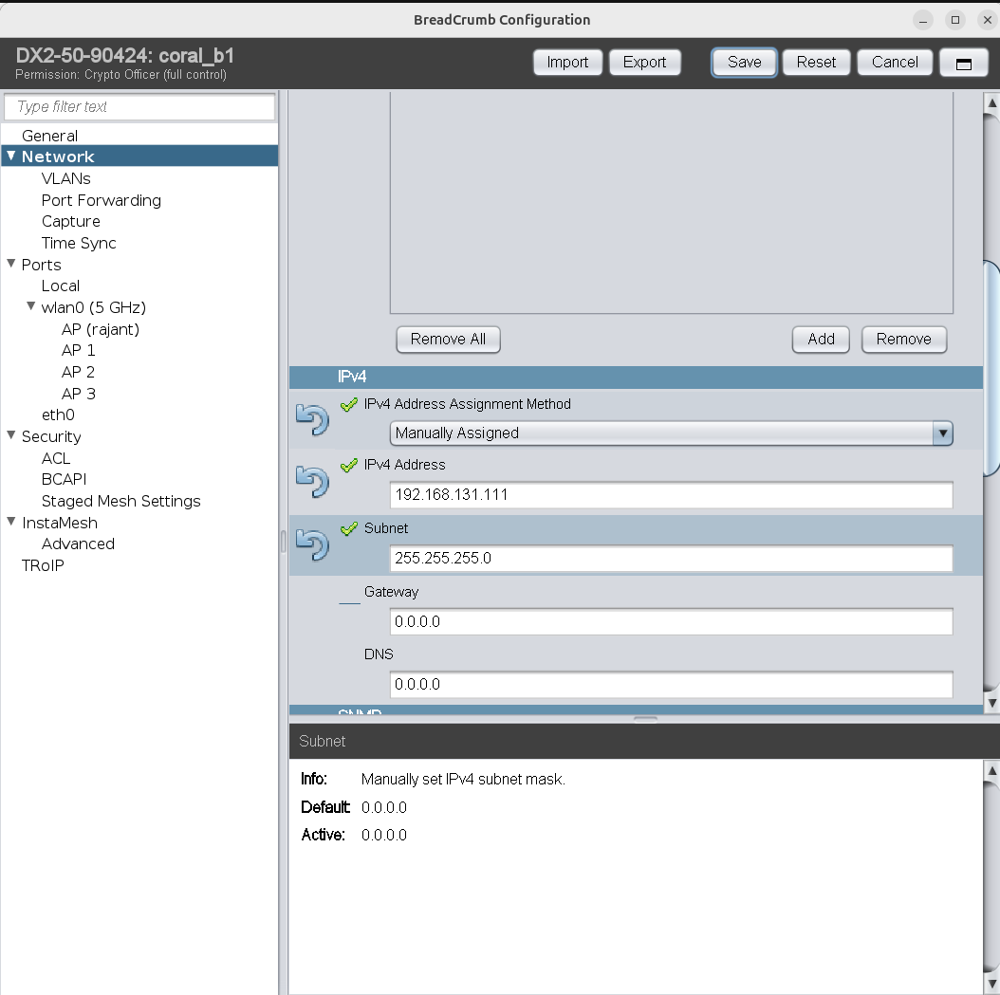

# Rajant mesh network
## 1 Kit components
Author: zhongmou.li@manchester.ac.uk

**Kit**
- Rajant nodes (DX and ES)
- Ethernet cable **(cat 6)**
- Injector AC/DC


**Host machine**
- Ubuntu 22.04
- ROS2 Humble

## 2. Setup Rajant
### 2.1 Connect nodes with injector
A Rajant node must be connected to a computer through an injector: a DC one or a AC one.

One example using a AC injector is given here. Connect the AC injector with power, and the Rajant node.



Then, connect the injector to the computer with another Ethernet Cable. **It is not fully tested, but Ethernect cables cat 5 cause instable connection, while cat 6 ones have no problems like that.**



### 2.2 Rajant configurator
We need to run Rajant configurator to set IP address of nodes. Even it is a Windows app, it can run quite well using `wine` on Linux.

It can start the programme by running
```bash
    wine ./bcc11.exe 
```
which shows us the interface to log in


The log in details are given by Craig West from UKAEA
- Type: Live mesh 
- User: Crypto officer 
- PWD:  breadcrumb-co

The nodes found are showing 


Each node is identified with a serial number, which can be found at the back of the nodes.
- the serial number of node in white is `ES1-2450R-89532`
- the serial number of node in blue is `DX2-50-90424`

 
The color indicates the statuses of the nodes: Green = talking to each other, Blue = power but not talking.

If no node is shown, we need to scan them


### 2.2 IP settings for computers and Rajant nodesf

Once a node can be listed, we are able to configure the IP address to enable wireless and mesh communication.



In the section Network, we first disable the DHCP server in order to use static ip addresses for all devices.



Then, set the IP address of this Rajent node. 


All the nodes used and the devices in the same network must share the same subnet. For instance, their IP address must have the same format like 192.68.131.XXX with the subnet being 255.255.255.0.

## 2. ROS2 communication with Rajant nodes and computers
Static IP addresses are hightly recommended. Take the devices in CORAL for example.

The IP addresses are set to be in the same subnet as following:
- a blue node (DX) is `192.168.131.111`
- an drone onbard computer is `192.168.131.101`
- a white node (ES) is `192.168.131.211`
- a base station is `192.168.131.11`

With same DDS and same `ROS_DOMAIN_ID`, then the drone onboard computer can talk to the base station.