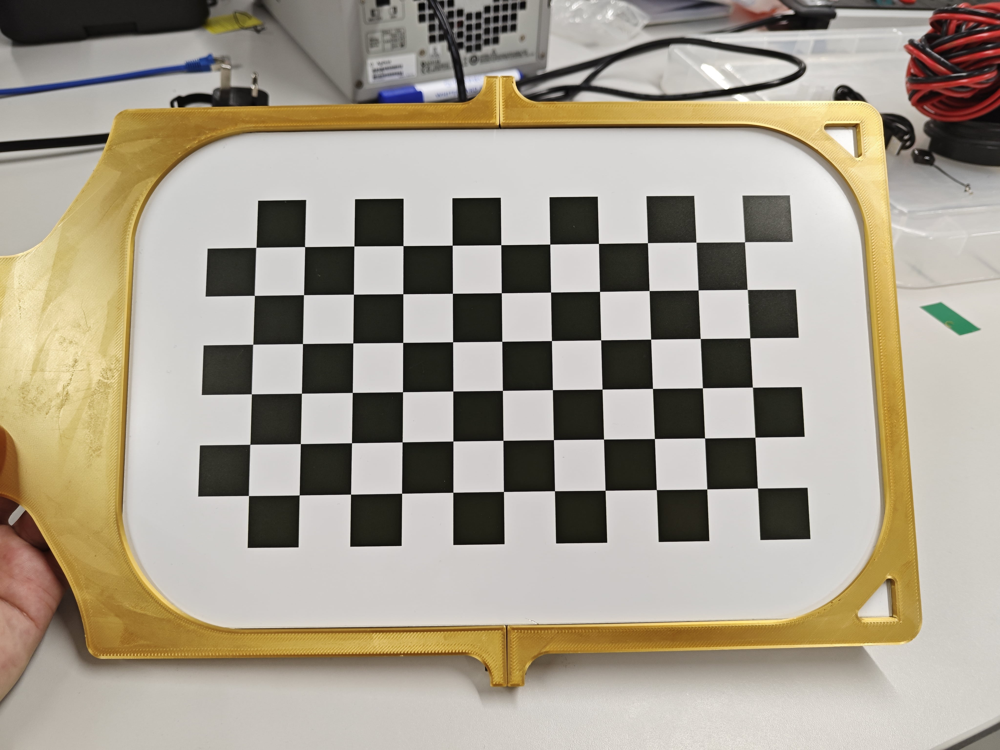
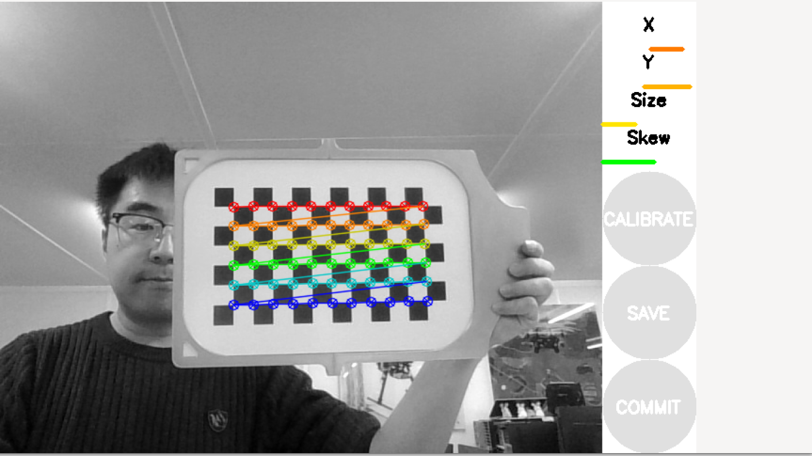

# Camera calibration
## 1 Kit components
Author: zhongmou.li@manchester.ac.uk

**Kit**
- ros2 pkgs
    - ros-humble-camera-calibration-parsers
    - ros-humble-camera-info-manager
    - ros-humble-launch-testing-ament-cmake
    - https://github.com/ros-perception/image_pipeline
- [Pattern Generator](https://calib.io/pages/camera-calibration-pattern-generator) 
- 
**Host machine**
- Ubuntu 22.04
- ROS2 Humble

**Reference**
- [Nav2, Camera Calibration](https://docs.nav2.org/tutorials/docs/camera_calibration.html)
- [Offline Camera Calibration in ROS 2](https://medium.com/starschema-blog/offline-camera-calibration-in-ros-2-45e81df12555)
  
## 2 Install ROS2 camera calibration pkg
```bash
    sudo apt install ros-humble-camera-calibration-parsers
    sudo apt install ros-humble-camera-info-manager
    sudo apt install ros-humble-launch-testing-ament-cmake
```
and build a pkg from source 
```bash
    cd ros_ws/src #replace it with yours
    git clone -b humble https://github.com/ros-perception/image_pipeline
    cd ros_ws
    colcon build
```

## 3. Get chestboard
1.  use [https://calib.io/pages/camera-calibration-pattern-generator](https://calib.io/pages/camera-calibration-pattern-generator) to generate a checkerboard.

  

Following the suggestions at [Offline Camera Calibration in ROS 2](https://medium.com/starschema-blog/offline-camera-calibration-in-ros-2-45e81df12555), for a A4/US letter page, I choose an 7x12 board with 20mm squares. 

Here is one we get in RAICo.
 


## 4. Calibration
NOTE there: even we choose the size of board as 7x12, in calibration we use the interior corners as the size, therefore the size in calibration is 6x11. 
```bash
    ros2 run camera_calibration cameracalibrator --size 6x11 --square 0.02 --ros-args --remap image:=/camera1/image_raw --ros-args --remap camera:=/camera1
```
  

Here is the command to calibrate Basler camera 
```bash
    ros2 run camera_calibration cameracalibrator --size 6x11 --square 0.02 --ros-args --remap image:=/my_camera/pylon_ros2_camera_node/image_raw --ros-args --remap camera:=/my_camera/pylon_ros2_camera_node
```

Then you should see
```bash
Waiting for service camera/set_camera_info ...
OK
Waiting for service left_camera/set_camera_info ...
OK
Waiting for service right_camera/set_camera_info ...
OK
[WARN] [1759334647.953247742] [cameracalibrator]: No publishers available for topic /left. Using system default QoS for subscriber.
[WARN] [1759334647.955351406] [cameracalibrator]: No publishers available for topic /right. Using system default QoS for subscriber.

(python3:5448): dbind-WARNING **: 16:04:07.959: Couldn't connect to accessibility bus: Failed to connect to socket /run/user/1000/at-spi/bus: No such file or directory
Gtk-Message: 16:04:07.974: Failed to load module "canberra-gtk-module"
Gtk-Message: 16:04:07.975: Failed to load module "canberra-gtk-module"
*** Added sample 1, p_x = 0.531, p_y = 0.994, p_size = 0.277, skew = 0.181
*** Added sample 2, p_x = 0.562, p_y = 0.937, p_size = 0.305, skew = 0.091
*** Added sample 3, p_x = 0.660, p_y = 0.864, p_size = 0.341, skew = 0.109
*** Added sample 4, p_x = 0.495, p_y = 0.913, p_size = 0.355, skew = 0.030
*** Added sample 5, p_x = 0.381, p_y = 0.842, p_size = 0.348, skew = 0.038
    
```

Move the checkerboard until the four lines become green, then lick the button `Calibrate`. The output of using Basler camera is 

```
**** Calibrating ****
mono pinhole calibration...
D = [-0.1855895035025632, 0.09250161146030608, -0.00019004380918710018, 0.0012011485216892029, 0.0]
K = [1200.9194578682213, 0.0, 621.0797853701526, 0.0, 1200.1751315273539, 496.9581503072852, 0.0, 0.0, 1.0]
R = [1.0, 0.0, 0.0, 0.0, 1.0, 0.0, 0.0, 0.0, 1.0]
P = [1140.9989013671875, 0.0, 620.3406089456475, 0.0, 0.0, 1159.812255859375, 495.3710954588314, 0.0, 0.0, 0.0, 1.0, 0.0]
None
# oST version 5.0 parameters


[image]

width
1280

height
1024

[narrow_stereo]

camera matrix
1200.919458 0.000000 621.079785
0.000000 1200.175132 496.958150
0.000000 0.000000 1.000000

distortion
-0.185590 0.092502 -0.000190 0.001201 0.000000

rectification
1.000000 0.000000 0.000000
0.000000 1.000000 0.000000
0.000000 0.000000 1.000000

projection
1140.998901 0.000000 620.340609 0.000000
0.000000 1159.812256 495.371095 0.000000
0.000000 0.000000 1.000000 0.000000
```
