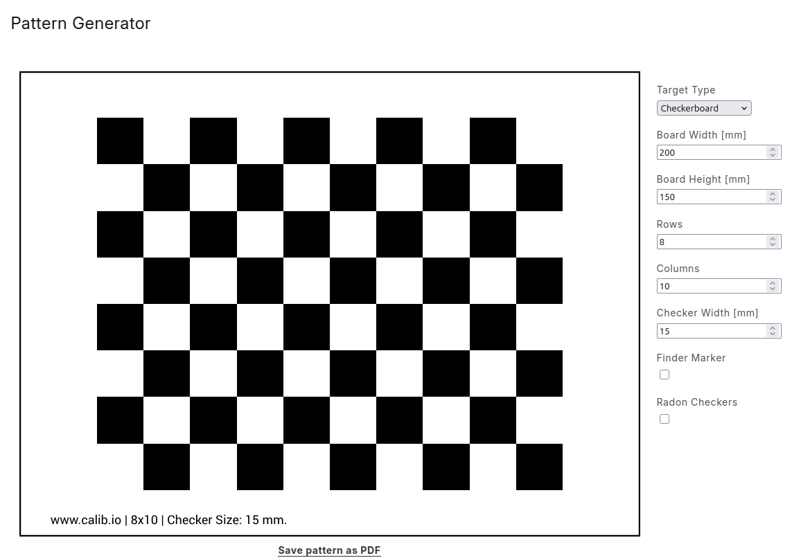

# AprilTag
## 1 Kit components
Author: zhongmou.li@manchester.ac.uk

**Kit**
- ros-<ros2-distro>-camera-calibration (apt pkg)
- [Pattern Generator](https://calib.io/pages/camera-calibration-pattern-generator) 
- 
**Host machine**
- Ubuntu 22.04
- ROS2 Humble
  

**Reference**
- [Nav2, Camera Calibration](https://docs.nav2.org/tutorials/docs/camera_calibration.html)
- [Offline Camera Calibration in ROS 2](https://medium.com/starschema-blog/offline-camera-calibration-in-ros-2-45e81df12555)
  
## 2 Install ROS2 camera calibration pkg
```bash

```

## 3. Get chestboard
1.  use [https://calib.io/pages/camera-calibration-pattern-generator](https://calib.io/pages/camera-calibration-pattern-generator) to generate a checkerboard.


  

Following the suggestions at [Offline Camera Calibration in ROS 2](https://medium.com/starschema-blog/offline-camera-calibration-in-ros-2-45e81df12555), for a A4/US letter page, I choose an 8x10 board with 15mm squares. 

