# Skycharge
## 1 Kit components
Author: zhongmou.li@manchester.ac.uk

**Kit**
- Skycharge source and sink
- Ethernet cable 
- Wifi Router
- Power bank (optional)
- Lipo battery (other battery)

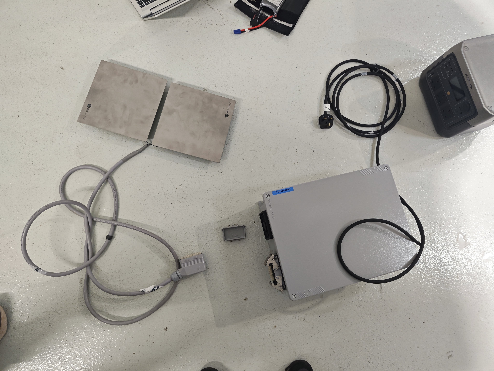

**Host machine**
- Ubuntu 22.04

**User guide**
- [User's manual introduction of Skycharge](https://support.skycharge.de/docs/um-introduction)

## 2. Setup Skycharge

The overview of the whole system including a skycharge charging systgem, a host machine, a powerbank and a battery is shown as 


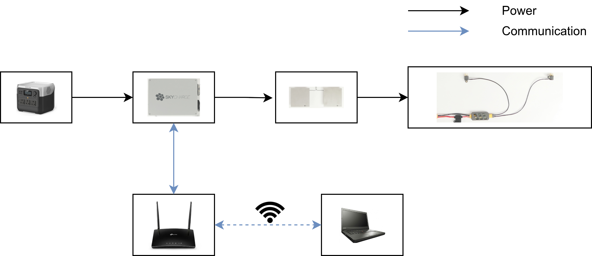

### 2.1 Install Skycharge
How to install skycharge source and sink can be found at [Skycharge system installation](https://support.skycharge.de/docs/skycharge-system) and [Conductive tiles installation](https://support.skycharge.de/docs/conductive-tiles).

### 2.2 Connect powerbank, souce and sink
First, the source needs to be connected to the sink and the power bank to enable using the power from the power bank to the sink.

There is a lock for the connection between the source and the sink.

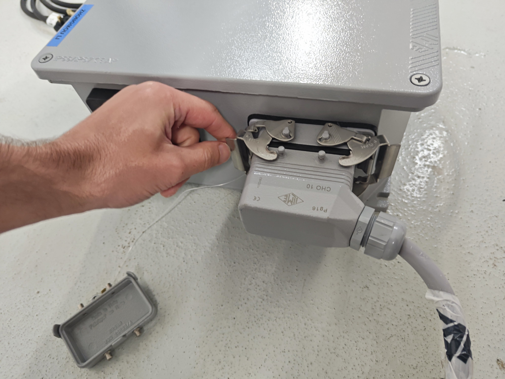

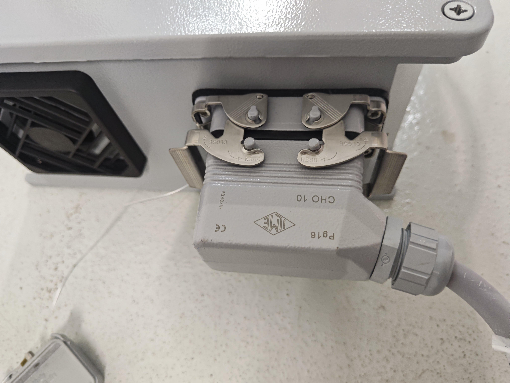

For the connection between the source and the power bank

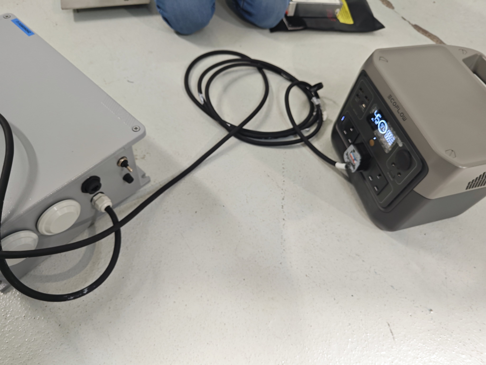

### 2.3 Connect sink to contact unit
The sink should connect to a contact unit. A guide is given by Skycharge at [Skycharge system installation](https://support.skycharge.de/docs/skycharge-system). 

However, our connection in this example is done by Fly4Future, show in the image below

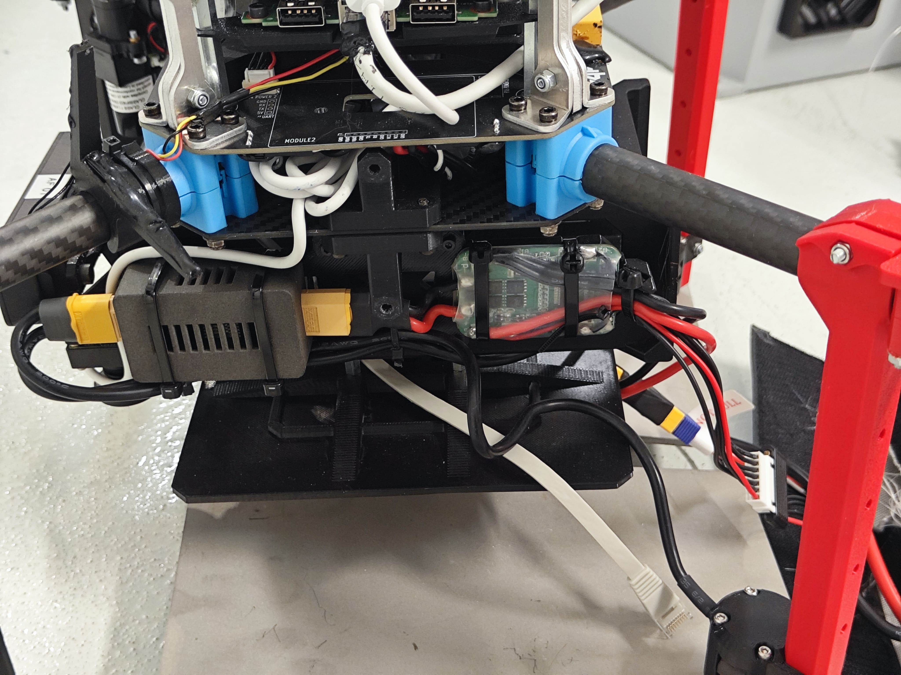

The battery should be coneected to the contact unit like this
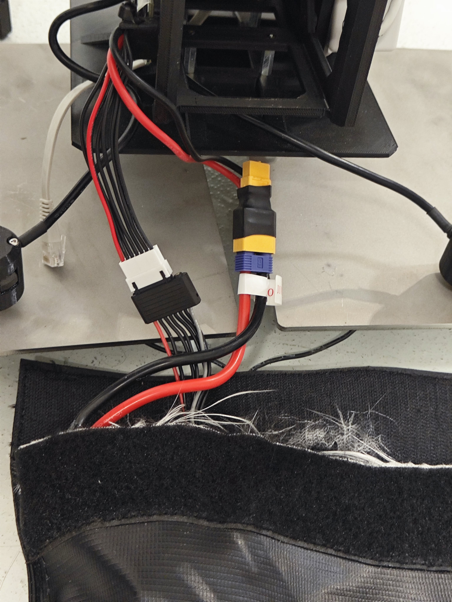

### 2.3 Connect router, source and host machine
The host machine controls and monitors charging, therefore we need to enbale the communciatio between the host machine and the source with a wifi router.

The source is connected to the router using an Ethernet cable, while the host machine can connect to the wifi generated by the router.

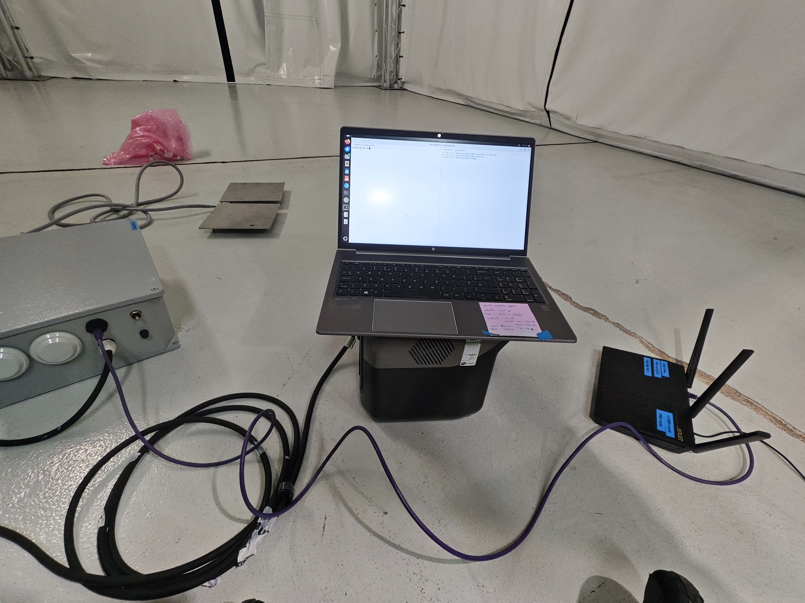

## 3 Configure Skycharge and charge battery
### 3.1 Install Skycharge SDK on host machine

Run the commands to install [Skycharge SDK](https://support.skycharge.de/docs/sdk)
```bash
apt update
apt install skycharge-conf skycharged skycharge-cli
```

First, download a private key from [skycharge: Connect to your Skycharge system](https://support.skycharge.de/docs/how-to-connect) for using ssh to connect to Skycharge.

Copy and past the key into your ssh folder, usually it is `~/.ssh` on Linux.

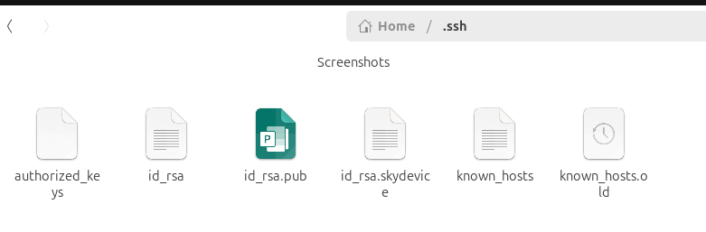

Consider that we have already enable the communicatio between the source and the host machine with the router. Now, we log in the skycharge system on the source using the private key running
```bash
ssh -i ~/.ssh/id_rsa.skydevice root@skydevice.local #on the host machine
```
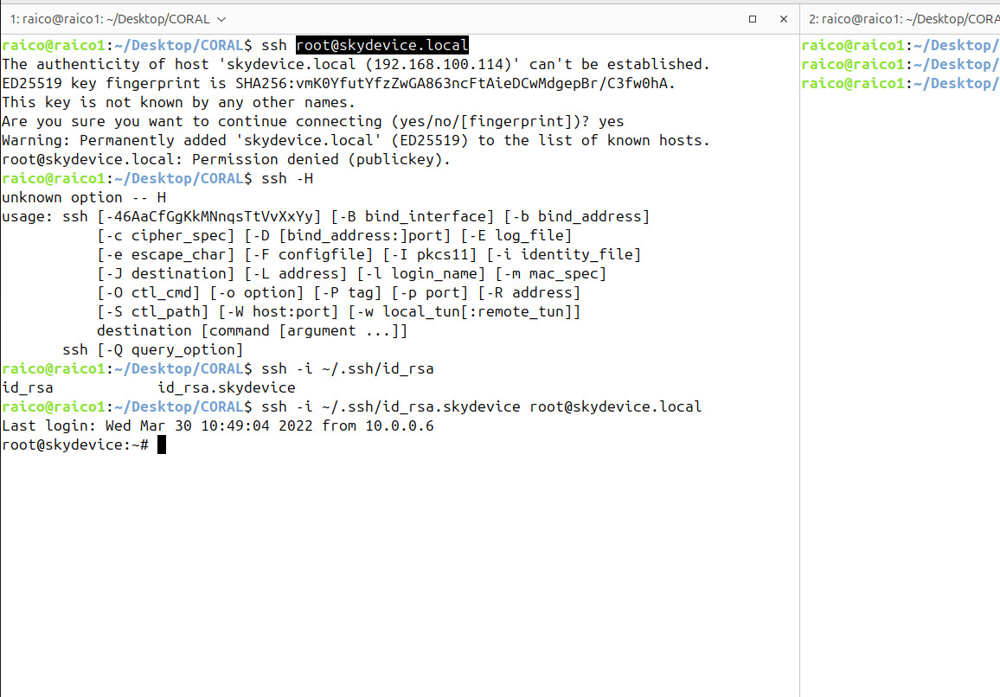


After logging in, we can monitor the skycharing system' status by running  

```bash
skycharge-cli monitor --pretty #in the server on the source
```

If there is no charging, we should see an output like 

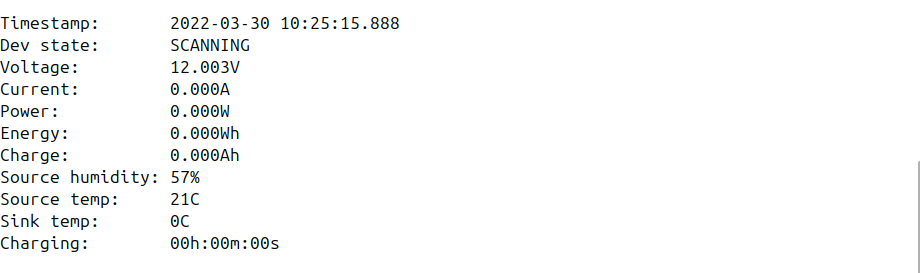

### 3.2 Configure Skycharge on the source
The work in this subsectin is in the server on the source.

Charging settings should depend on the batteries and a configuration file of Skycharge must be adjusted for different batteries. The battery used here is one with 6S and 8000mAh.

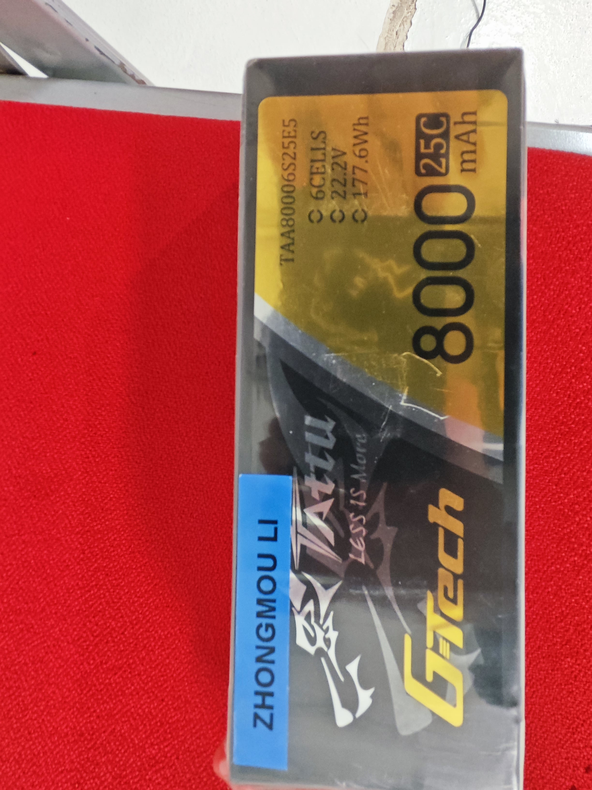

The configuration file is `/etc/skycharge.conf`.
Take the battery in the photo for example:
- It is is 6S LiPo battery
- Capaity is 8000mAH
- Max voltage is set to be 24500 (4V for each cell)in a conservative way as its limit is 6 * 4.2 * 1000 = 25200
- Min voltage is  set to be 18000 as 3V per cell is the limit
- Max charging current is set as 5000mA (this should be recalculated for different battery).
- Precharging current is set as 1000mA (this should be recalculated for different battery).

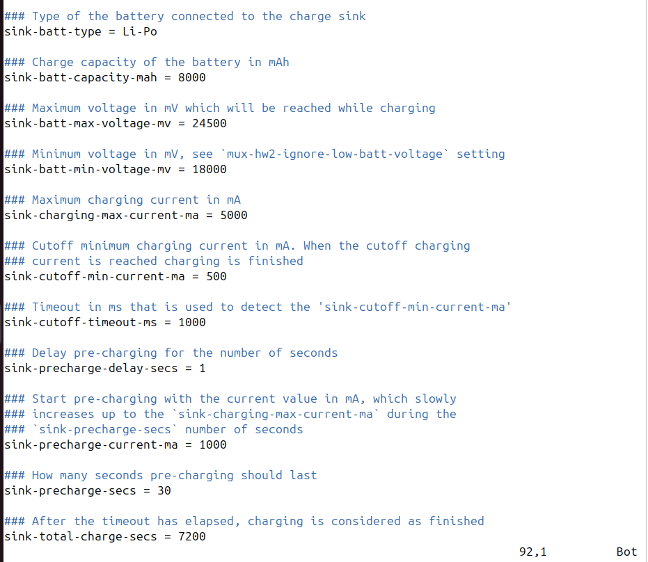

After updating `/etc/skycharge.conf`, we need to run 
```bash
systemctl restart skycharged #in the server on the source
```
to implement the changes. 

### 3.2 Charge battery using Skycharge
To charge the battery of the drone, we place the drone on the sink like this. The connectors have been installed on the legs of drone.

Not the two devices of the sink system should not get any contact, as it could result to short circuit.

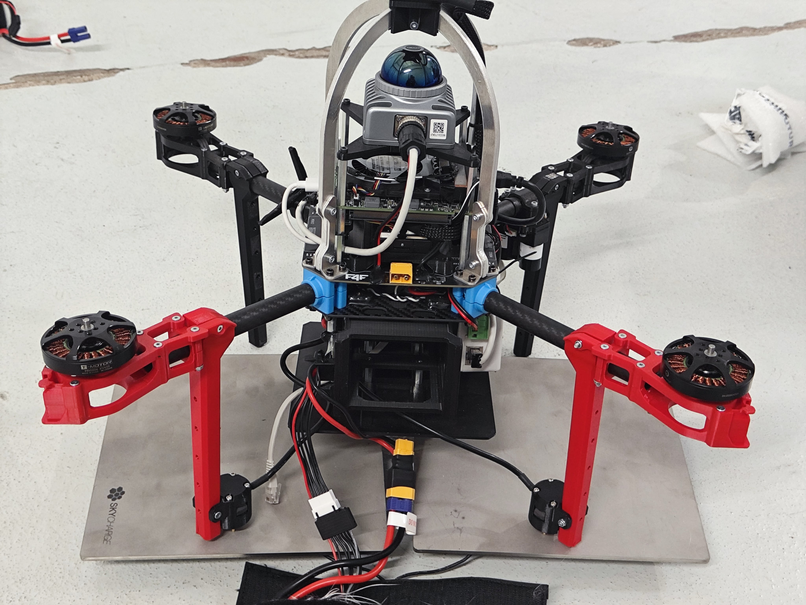

Remember, the monitor should be alwasys running to obtain the information 
```bash
    skycharge-cli monitor --pretty #in the server on the source
```

Once the connection is established, we should see the status of charging system become `precharging`, which means the skycharge system is preparing to charge the battery.

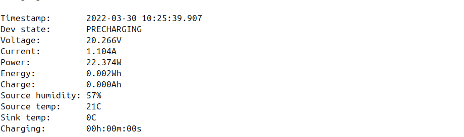

Then, it should become `charging` and the battery is being charged.

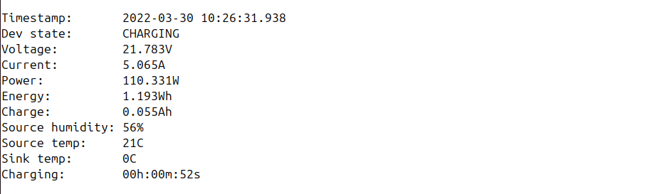

The current in `precharging` and `charging` is defined in `/etc/skycharge.conf` previously. It is suggested to monitor the charging, however it may take a lot of time and it takes more than 2h for the battery we used (6S and 8000mAh). Therefore, be patient (the time in the image below is only 31m because I stoped charging for several times to check the battery's voltage).

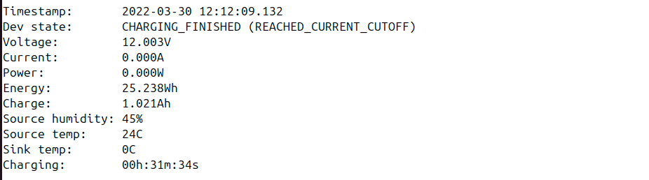
