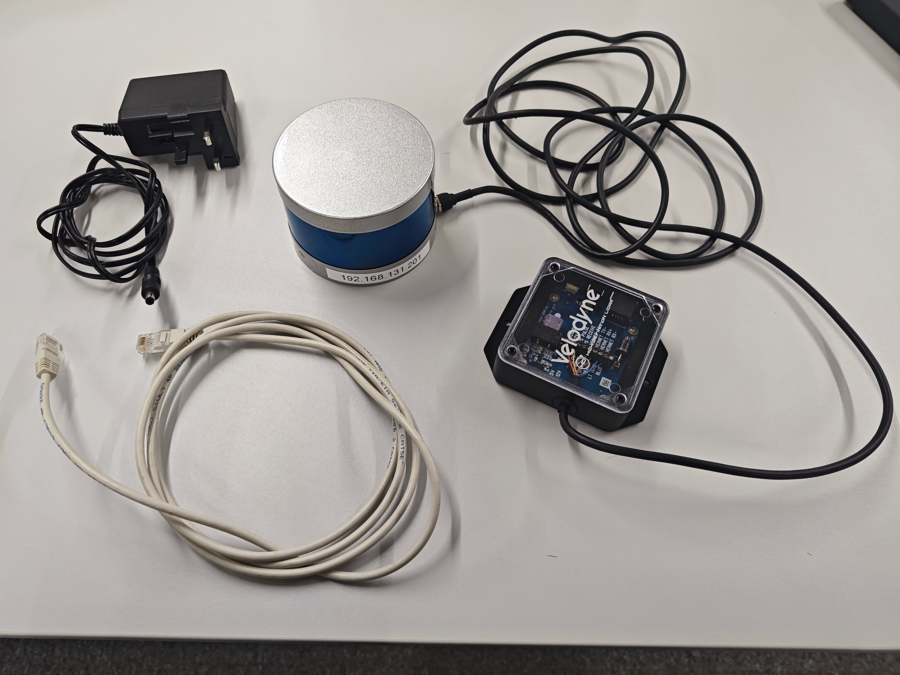
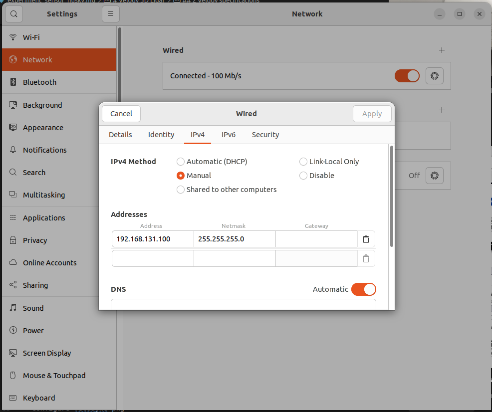
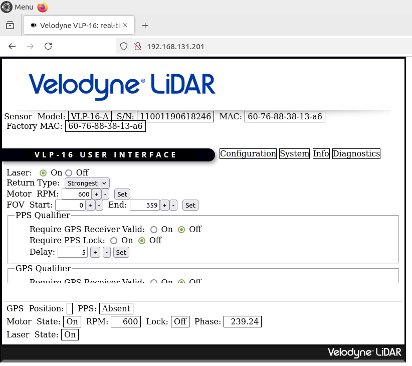
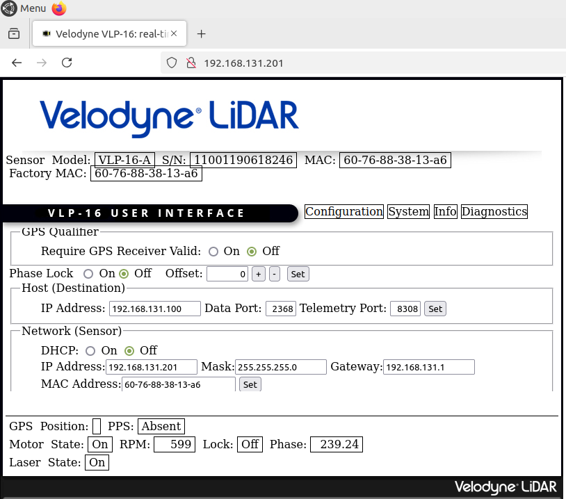
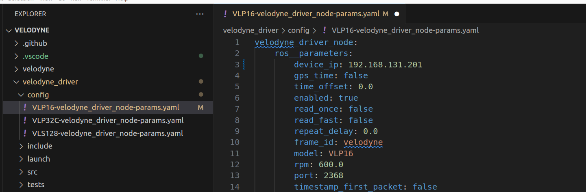
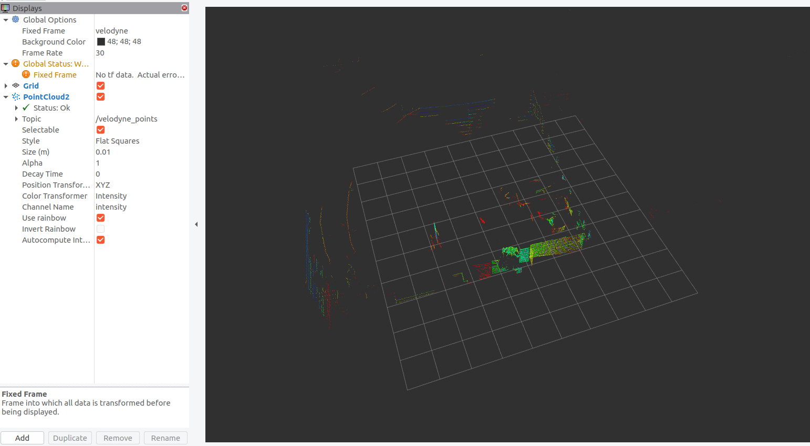

# Velody 3D Lidar (VLP-16)
## 1 Kit components
Author: zhongmou.li@manchester.ac.uk

**Kit**
- Velody (VLP-16 PUCK)
- Power module
- Ethernet cable 


**Host machine**
- Ubuntu 22.04
- ROS2 Humble


## 2 Veldoy specifications
- Model : VLP-16
- Number of channels: 16
- Horizontal field of view: 360d
- Horizontal resolution: 0.1d - 0.4d depending on LIDAR's RPM
    - 300RPM - 0.1d
    - 500RPM - 0.2d
    - 900RPM - 0.3d
    - 1200RPM - 0.4d
    - source: Table 8-1 Rotation Speed vs Resolution in VLP-16 User Manual
- Minimal LIDAR range
- Maximal LIDAR range: 100m
- Range accuracy: <±3 cm 

Source:
- VLP-16 User Manual, [https://data.ouster.io/downloads/velodyne/user-manual/vlp-16-user-manual-revf.pdf](https://data.ouster.io/downloads/velodyne/user-manual/vlp-16-user-manual-revf.pdf)
- VLP-16 PUCK datasheet, [https://ouster.com/downloads/velodyne-downloads](https://ouster.com/downloads/velodyne-downloads)

## 3 Setup VLP-16
Step 1. Connect a host machine with an Ethernet cable and Power it


Step 2. Set a static IP address of Host machine


Step 3. Set VLP-16
- Open a browser and input the address ```192.168.131.201``` and should be able to see a page like below
    

  The address depends on your sensor, the one in our team has a label saying ```192.168.131.201```.
- We can set motor RPM here depending on what horizontal resolution we want (see [1.1 Veldoy specifications](##1.1-veldoy-specifications)), and here is set to be 600 which results into 0.2d.
- We need to specify the IP address and the port (2368 here) of host machine and and chick ```set``` and it is also possible to modify the IP address of VLP-16 that is in section *Network (sensor)*
    

Now, we have finished setting the host machine's IP address and port to receive sensor data, the IP address and the RPM of VLP-16.

## 4 Build and run ROS2 driver
Step 1. Install dependencies 
```shell
    sudo aptitude install libpcap-dev
```

Step 2. Clone and build ROS2 driver
- Get source code 
    ```shell
        cd ros2/src
        git clone https://github.com/ros-drivers/velodyne
        cd veloydne
        git checkout ros2
    ```
- Configure velodyne pkg 
    - go to ```velodyne_driver/config``` and modify ```VLP16-velodyne_driver_node-params.yaml```
     
    - set parameters
        - ```device_ip``` to be the IP of Velodyne ```192.168.131.201```
        - ```rpm``` and ```port```  should be what we set before in [Configure vlp](###1.2.1-configure-VLP-16), which is ```600.0``` and ```2368```.
        - ```velodyne``` will be used in Rviz2 for visualisation  
- Build 
    ```shell
        cd ros2
        colcon build --packages-select velodyne_laserscan velodyne_msgs velodyne_driver velodyne_pointcloud
        colcon build --packages-select velodyne
        source install/setup.bash
    ```
- Run 
    ```shell
        ros2 launch velodyne velodyne-all-nodes-VLP16-launch.py
    ```
- Visualise in Rviz2
    - set ```velodyne``` as the fixed frame
    - add PointCloud2 with ```velodyne_points``` 

    